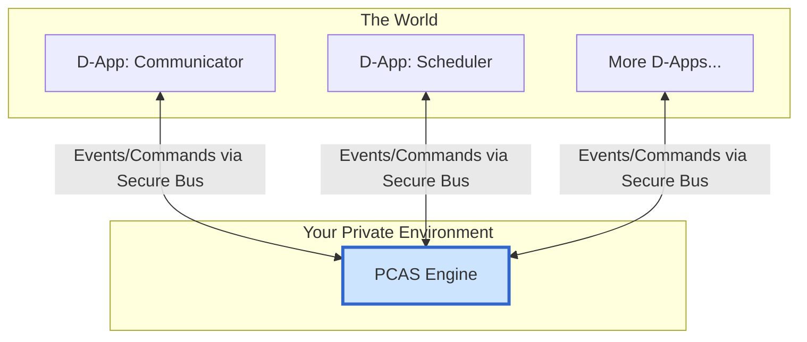

[简体中文](README.zh.md)

# PCAS (Personal Central AI System)

**PCAS is an open-source, local-first, intelligent decision-making engine designed to power a new generation of personal AI operating systems.**

It serves as the core technical heart of the **DreamHub Ecosystem**, a broader vision for a user-centric AI future built on the principle of "Absolute Data Sovereignty, Flexible Compute Scheduling."

---

## 📖 What is PCAS?

PCAS is not a user-facing application. It is a **deployable software engine** that you run in your private environment (e.g., your PC or home server). Its sole purpose is to act as a secure and intelligent "decision-making center" for your digital life.

It connects to various applications and services (we call them D-Apps) through an **Intelligent Event Bus**, allowing you to create powerful, automated workflows while ensuring your data never leaves your control.

> To delve deeper into the philosophy and technicals, please read the **[PCAS Whitepaper](docs/WHITEPAPER.md)** and the **[PCAS Technical Plan](docs/PCAS_PLAN.md)**.

## ✨ Core Features

*   **🛡️ Absolute Data Sovereignty:** PCAS and your data run in your private environment. You have full control. Period.
*   **🎛️ Flexible Compute Modes:** Through a built-in "Policy Engine," you decide how AI tasks are processed:
    *   **Local Mode:** Maximum privacy with local AI models.
    *   **Hybrid Mode:** The perfect balance of privacy and performance.
    *   **Cloud Mode:** Maximum power using cloud AI APIs.
*   **🤖 Intelligent Decision-Making:** PCAS acts as your "Personal Decision Center," understanding your intent and coordinating D-Apps to get things done.
*   **🧩 Open D-App Ecosystem:** The event bus architecture allows any service to be integrated as a D-App.
*   **🚀 Foundation for Personal AI:** PCAS is designed to be a "Data Crucible," helping you build a private dataset to fine-tune your own personal AI models.
*   **🌐 Open Standard & Community:** We aim for PCAS to become an open standard for a new pattern of personal AI.

## 🏛️ Architecture

PCAS is the central hub in a mesh-like, event-driven network of D-Apps.

## 🚀 Getting Started (Actionable Roadmap)

The project is in active development based on the following roadmap. Our core principle: **"Run one chain, then go upstairs."**

| ETA | Target | Key Deliverables |
| :--- | :--- | :--- |
| **+2 Weeks** | **Minimal Event Bus & CLI** | `pcas serve`, `pcas emit` commands; `trace_id`. |
| **+1 Month** | **Policy v0 + Providers** | `policy.yaml` static rules; `OpenAIProvider` & `MockLocalProvider`. |
| **+2 Months**| **Explainable AI + Graph Store** | LLM-decide() with decision logs; SQLite persistence. |
| **+3 Months**| **SDK & Example D-Apps** | Go/TS SDK; Scheduler, Communicator, Knowledge D-Apps. |
| **+4 Months**| **Preview Release & Community** | GitHub Beta Tag; Docs Site; RFC process. |

## 🤝 Community & Contribution

PCAS is an open-source project driven by the community. We sincerely invite you to join us.

*   **Join the discussion:** [Discord Link TBD]
*   **Contribute:** Please read our `CONTRIBUTING.md` (TBD).
*   **Report issues:** Please use the Issues section.

## 📄 License

PCAS is open-sourced under the [MIT License](LICENSE).