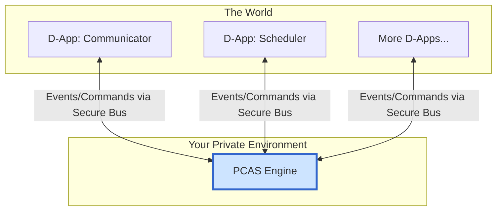

<<<<<<< HEAD
# PCAS (Personal Central AI System)

**PCAS is an open-source, local-first, intelligent decision-making engine designed to power a new generation of personal AI operating systems.**

It serves as the core technical heart of the **DreamHub Ecosystem**, a broader vision for a user-centric AI future built on the principle of "Absolute Data Sovereignty, Flexible Compute Scheduling."

---

## 📖 What is PCAS?

PCAS is not a user-facing application. It is a **deployable software engine** that you run in your private environment (e.g., your PC or home server). Its sole purpose is to act as a secure and intelligent "decision-making center" for your digital life.

It connects to various applications and services (we call them D-Apps) through an **Intelligent Event Bus**, allowing you to create powerful, automated workflows while ensuring your data never leaves your control.

> To delve deeper into the philosophy and technicals, please read the **[PCAS Whitepaper](docs/architecture/whitepaper.md)** and the **[PCAS Architecture Overview](docs/architecture/pcas-overview.md)**.

## ✨ Core Features

*   **🛡️ Absolute Data Sovereignty:** PCAS and your data run in your private environment. You have full control. Period.
*   **🎛️ Flexible Compute Modes:** Through a built-in "Policy Engine," you decide how AI tasks are processed:
    *   **Local Mode:** Maximum privacy with local AI models.
    *   **Hybrid Mode:** The perfect balance of privacy and performance.
    *   **Cloud Mode:** Maximum power using cloud AI APIs.
*   **🤖 Intelligent Decision-Making:** PCAS acts as your "Personal Decision Center," understanding your intent and coordinating D-Apps to get things done.
*   **🧩 Open D-App Ecosystem:** The event bus architecture allows any service to be integrated as a D-App.
*   **🚀 Foundation for Personal AI:** PCAS is designed to be a "Data Crucible," helping you build a private dataset to fine-tune your own personal AI models.
*   **🌐 Open Standard & Community:** We aim for PCAS to become an open standard for a new pattern of personal AI.

## 🏛️ Architecture

PCAS is the central hub in a mesh-like, event-driven network of D-Apps.


```mermaid
graph TD
    subgraph "The World"
        DApp1[D-App: Communicator]
        DApp2[D-App: Scheduler]
        DAppN[More D-Apps...]
    end

    subgraph "Your Private Environment"
        PCAS_Core[PCAS Engine]
    end

    %% Communication Flow
    DApp1 <--> |Events/Commands via Secure Bus| PCAS_Core
    DApp2 <--> |Events/Commands via Secure Bus| PCAS_Core
    DAppN <--> |Events/Commands via Secure Bus| PCAS_Core

    style PCAS_Core fill:#cde4ff,stroke:#36c,stroke-width:3px
```

## 🚀 Quick Start

Get PCAS up and running in minutes with our modern development workflow.

### Prerequisites

- Go 1.24+
- Docker and Docker Compose
- An OpenAI API key (OpenAI or OpenRouter key)

### 1. Clone and Setup

```bash
git clone https://github.com/soaringjerry/pcas.git
cd pcas
```

### 2. Configure Environment

Create a `.env` file in the project root:
```bash
# Required: Your OpenAI API key
OPENAI_API_KEY=sk-your-api-key-here

# Optional: Customize ports if needed
PCAS_PORT=50051
POSTGRES_PORT=5432
```

### 3. Start Everything

Use our all-in-one command:
```bash
make dev-up
```

This will:
- Start PostgreSQL with pgvector extension
- Initialize the database schema
- Build the PCAS binaries
- Start the PCAS server with your configuration

### 4. Try It Out

**Create a memory with user identity:**
```bash
./bin/pcasctl emit --type pcas.memory.create.v1 \
  --user-id alice \
  --subject "My favorite programming language is Go"
```

**Ask a question (with RAG-enhanced response):**
```bash
./bin/pcasctl emit --type pcas.user.prompt.v1 \
  --user-id alice \
  --data '{"prompt": "What is my favorite programming language?"}'
```

**Search memories semantically:**
```bash
./bin/pcasctl search "programming preferences"
```

### 5. Explore Advanced Examples

Check out our Multi-AI Chatbot example to see PCAS's multi-identity capabilities in action:
```bash
cd examples/multi-ai-chatbot
go run main.go --user-id alice
```

### 🛑 Stopping PCAS

```bash
make dev-down
```

This cleanly shuts down all services and preserves your data.

### Alternative: CLI Guided Setup

Prefer a lightweight, interactive flow without Compose?

- Run guided setup: `pcasctl setup`
  - Generates/updates `.env` and `policy.yaml`, and can start the server.
- Start server manually: `pcas serve --host 0.0.0.0 --port 50051`
- Send a test event: `pcasctl emit --type pcas.test.echo.v1 --data "{\"prompt\":\"hello\"}"`
- One‑click Docker install/update pulls newest build by default (edge channel). Use `--channel stable` to pin releases.

Using OpenRouter instead of OpenAI:
- Set env: `OPENAI_BASE_URL=https://openrouter.ai/api/v1` and use an OpenRouter API key in `OPENAI_API_KEY`.
- Optional headers (recommended by OpenRouter): `OPENROUTER_SITE_URL=https://your.site` and `OPENROUTER_APP_NAME=PCAS`.
- Auto-detect: if your `OPENAI_API_KEY` starts with `sk-or-`, PCAS will default to `https://openrouter.ai/api/v1` unless `OPENAI_BASE_URL` is explicitly set.

## 🤝 Community & Contribution

PCAS is an open-source project driven by the community. We sincerely invite you to join us.

*   **Join the discussion:** [Discord Link TBD]
*   **Contribute:** Please read our [Contribution Guide](CONTRIBUTING.md).
*   **Documentation:** Explore our comprehensive [Documentation Portal](docs/README.md).
*   **Report issues:** Please use the Issues section.

## 📄 License

PCAS is open-sourced under the [MIT License](LICENSE).
=======
[简体中文](README.zh.md)

# PCAS (Personal Central AI System)

**PCAS is an open-source, local-first, intelligent decision-making engine designed to power a new generation of personal AI operating systems.**

It serves as the core technical heart of the **DreamHub Ecosystem**, a broader vision for a user-centric AI future built on the principle of "Absolute Data Sovereignty, Flexible Compute Scheduling."

---

## 📖 What is PCAS?

PCAS is not a user-facing application. It is a **deployable software engine** that you run in your private environment (e.g., your PC or home server). Its sole purpose is to act as a secure and intelligent "decision-making center" for your digital life.

It connects to various applications and services (we call them D-Apps) through an **Intelligent Event Bus**, allowing you to create powerful, automated workflows while ensuring your data never leaves your control.

> To delve deeper into the philosophy and technicals, please read the **[PCAS Whitepaper](docs/WHITEPAPER.md)** and the **[PCAS Technical Plan](docs/PCAS_PLAN.md)**.

## ✨ Core Features

*   **🛡️ Absolute Data Sovereignty:** PCAS and your data run in your private environment. You have full control. Period.
*   **🎛️ Flexible Compute Modes:** Through a built-in "Policy Engine," you decide how AI tasks are processed:
    *   **Local Mode:** Maximum privacy with local AI models.
    *   **Hybrid Mode:** The perfect balance of privacy and performance.
    *   **Cloud Mode:** Maximum power using cloud AI APIs.
*   **🤖 Intelligent Decision-Making:** PCAS acts as your "Personal Decision Center," understanding your intent and coordinating D-Apps to get things done.
*   **🧩 Open D-App Ecosystem:** The event bus architecture allows any service to be integrated as a D-App.
*   **🚀 Foundation for Personal AI:** PCAS is designed to be a "Data Crucible," helping you build a private dataset to fine-tune your own personal AI models.
*   **🌐 Open Standard & Community:** We aim for PCAS to become an open standard for a new pattern of personal AI.

## 🏛️ Architecture

PCAS is the central hub in a mesh-like, event-driven network of D-Apps.


```mermaid
graph TD
    subgraph "The World"
        DApp1[D-App: Communicator]
        DApp2[D-App: Scheduler]
        DAppN[More D-Apps...]
    end

    subgraph "Your Private Environment"
        PCAS_Core[PCAS Engine]
    end

    %% Communication Flow
    DApp1 <--> |Events/Commands via Secure Bus| PCAS_Core
    DApp2 <--> |Events/Commands via Secure Bus| PCAS_Core
    DAppN <--> |Events/Commands via Secure Bus| PCAS_Core

    style PCAS_Core fill:#cde4ff,stroke:#36c,stroke-width:3px
```

## 🚀 Getting Started (Actionable Roadmap)

The project is in active development based on the following roadmap. Our core principle: **"Run one chain, then go upstairs."**

| ETA | Target | Key Deliverables |
| :--- | :--- | :--- |
| **+2 Weeks** | **Minimal Event Bus & CLI** | `pcas serve`, `pcas emit` commands; `trace_id`. |
| **+1 Month** | **Policy v0 + Providers** | `policy.yaml` static rules; `OpenAIProvider` & `MockLocalProvider`. |
| **+2 Months**| **Explainable AI + Graph Store** | LLM-decide() with decision logs; SQLite persistence. |
| **+3 Months**| **SDK & Example D-Apps** | Go/TS SDK; Scheduler, Communicator, Knowledge D-Apps. |
| **+4 Months**| **Preview Release & Community** | GitHub Beta Tag; Docs Site; RFC process. |

## 🧰 Quick Start

- One-time setup: `pcasctl setup`
  - Guides environment (.env), generates/updates `policy.yaml`, and can start the server.
- Start server manually: `pcas serve --host 0.0.0.0 --port 50051`
- Send a test event: `pcasctl emit --type pcas.test.echo.v1 --data "{\"prompt\":\"hello\"}"`
- Update binaries/images: `pcasctl update` (rebuild from source and/or pull Docker image)

## 🤝 Community & Contribution

PCAS is an open-source project driven by the community. We sincerely invite you to join us.

*   **Join the discussion:** [Discord Link TBD]
*   **Contribute:** Please read our `CONTRIBUTING.md` (TBD).
*   **Report issues:** Please use the Issues section.

## 📄 License

PCAS is open-sourced under the [MIT License](LICENSE).
>>>>>>> 6c57eb8 (feat(cli): add interactive setup/update wizards (pcasctl setup, pcasctl update))
