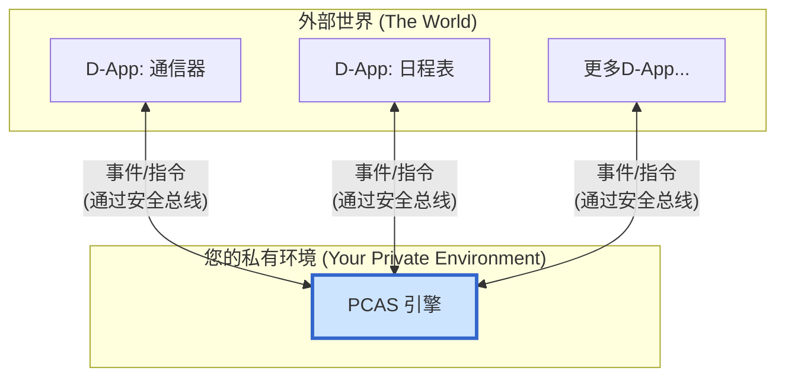

[English](README.md)

# PCAS (Personal Central AI System)

**PCAS 是一个开源的、本地优先的智能决策引擎，旨在驱动新一代的个人AI操作系统。**

它作为"**DreamHub生态**"的核心技术心脏。DreamHub是一个更宏大的、以用户为中心的AI未来愿景，建立在"**数据绝对主权，计算灵活调度**"的核心原则之上。

---

## 📖 PCAS是什么？

PCAS不是一个面向用户的应用程序，而是一个您可以部署在自己**私有环境**（例如您的个人电脑或家庭服务器）中的**软件引擎**。其唯一目的，是作为您数字生活的一个安全、智能的"决策中心"。

它通过一条**智能事件总线**，与各种应用程序和服务（我们称之为D-Apps）相连接，允许您创建强大的自动化工作流，同时确保您的数据永远不会离开您的掌控。

> 想要深入了解其哲学与技术细节，请阅读 **[PCAS白皮书](docs/WHITEPAPER.md)** 和 **[PCAS技术蓝图](docs/PCAS_PLAN.md)**。

## ✨ 核心特性

*   **🛡️ 数据绝对主权:** PCAS和您的数据运行在您的私有环境中。您拥有完全的控制权。
*   **🎛️ 计算灵活调度:** 通过内置的"策略引擎"，您可以决定AI任务如何被处理：
    *   **本地模式:** 最高的隐私性，使用本地AI模型。
    *   **混合模式:** 隐私与性能的完美平衡。
    *   **云端模式:** 最强的性能，使用云端AI API。
*   **🤖 智能决策核心:** PCAS作为您的"个人决策中心"，能理解您的意图，并协调D-Apps来完成工作。
*   **🧩 开放D-App生态:** 事件总线架构允许任何服务被集成为一个D-App。
*   **🚀 为个人AI奠基:** PCAS被设计成一个"数据熔炉"，帮助您建立私有数据集，以微调您自己的个人AI模型。
*   **🌐 开放标准与社区:** 我们的目标是让PCAS成为个人AI领域的一个开放标准和一种全新模式。

## 🏛️ 系统架构

PCAS是D-Apps协作网络中的中央枢纽，该网络是事件驱动的、网状的。



## 🚀 快速开始

本指南将带您体验 PCAS 的核心"语义记忆"功能 - 从存储记忆到执行语义搜索的完整流程。

### 1. 前置要求

开始之前，请确保您拥有：
- 一个 OpenAI API 密钥
- 一个运行中的 ChromaDB 实例（默认：`http://localhost:8000`）

### 2. 配置

PCAS 的行为由 `policy.yaml` 文件驱动。以下是一个最小化的入门配置：

```yaml
version: v1
providers:
  - name: mock-provider
    type: mock
  - name: openai-gpt4
    type: openai

rules:
  - name: "Rule for PCAS memory events"
    if:
      event_type: "pcas.memory.create.v1"
    then:
      provider: mock-provider
```

### 3. 构建与运行

构建项目：
```bash
make build
```

在新的终端中，启动 PCAS 服务：
```bash
export OPENAI_API_KEY="your-api-key-here"
export CHROMA_URL="http://localhost:8000"
./bin/pcas serve
```

### 4. 与 PCAS 交互

**存储记忆：**
```bash
./bin/pcasctl emit --type pcas.memory.create.v1 \
  --subject "项目的核心原则是'数据绝对主权，计算灵活调度。'"
```

**搜索记忆：**
```bash
./bin/pcasctl search "项目的基础理念是什么？"
```

您应该能在搜索结果中看到原始存储的句子，这展示了 PCAS 的语义理解能力。

## 🤝 社区与贡献

PCAS是一个由社区驱动的开源项目。我们诚挚地邀请您加入我们。

*   **加入讨论:** [Discord 链接待定]
*   **贡献代码:** 请阅读我们的 `CONTRIBUTING.md` (待创建)。
*   **报告问题:** 请使用 Issues 功能。

## 📄 许可证

PCAS 采用 [MIT License](LICENSE) 开源。
