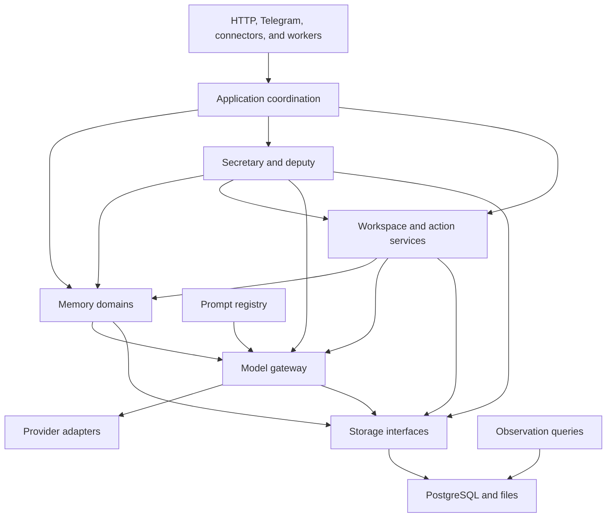
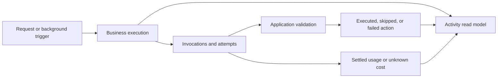
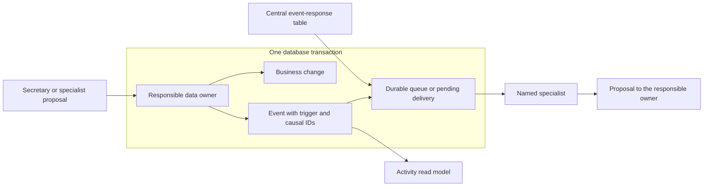

# PCAS System Architecture

Current architecture direction. Updated 2026-10-08.

Phase 3.9 makes business responsibilities explicit and business paths traceable before further repairs.
The [Whitepaper](whitepaper.md#phase-39-foundation) gives its product purpose and sequence.
The target below is not an implemented structure.
Execution scopes must follow [Executor Rules](../AGENTS.md) and the [Development Workflow](tasks/process.md).

The [shared skeleton scope](tasks/foundation-shared-skeleton.md) starts implementation with existing background calls.
Its [acceptance record](evaluations/2026-10-08-foundation-shared-skeleton.md) lists actual coverage, checks, and remaining paths.
The complete target below is not the delivery claim for that batch.

## 1 Foundation Scope

Examine all existing production paths, including HTTP, Telegram, connectors, imports, background work, and provider connection tests.
Include their configuration, dependencies, prompts, storage, tests, and current documents.
Move business workflows out of `internal/postgres` in complete paths.
Give each business rule and operation one responsible domain.

Stop feature expansion and separate symptom patches during the foundation.
Keep project, timeline, and task errors as cases with sources and observed results.
Complete the foundation before assigning further business repairs.
Keep known defects separate from migration regressions.
Existing defects do not become required behavior merely because the migration keeps them unchanged.

Keep Go, PostgreSQL, pgvector, and file storage.
Keep one application deployment with explicit internal interfaces.
Phase 3.9 keeps Phase 2.0 and its event-bus design archived.
Do not restore the earlier intelligent event bus or policy router.
The secretary and responsible domains make decisions. Events record occurrences and trigger declared processing.

The [Memory Architecture](memory-architecture.md) remains authoritative for memory behavior.

## 2 Code Findings

These findings come from repository revision `6b62f27`. They are code observations, not live quality measurements.

| Finding | Evidence | Required architecture result |
|---|---|---|
| Storage also owns business orchestration and providers. | [Store](../internal/postgres/database.go), [application setup](../cmd/pcas/main.go). | Domains own workflows. Storage owns persistence. Application setup connects their interfaces. |
| Model calls use different accounting and recovery paths. | [Background calls](../internal/postgres/background_model.go), [memory use](../internal/postgres/memory_use_model.go), [secretary retries](../internal/postgres/desk_model_retry.go). | One gateway covers calls while keeping applicable recovery and retry policies. |
| Deputy generation, saved results, revision, and review share a large workflow. | [Deputy](../internal/postgres/runs.go), [revision recovery](../internal/postgres/document_revise.go). | A deputy execution links its stages, calls, results, and final writes. |
| Telegram transcription bypasses application accounting. | [Telegram poller](../internal/telegram/poller.go), [transcription adapter](../internal/ai/transcription.go). | Channel adapters use the gateway. Every attempted call has an outcome and accounting status. |
| Legacy routing sends input through an independent provider path. | [Jev adapter](../internal/ai/jev.go), [routes](../internal/httpapi/workspace.go), [connection test](../internal/httpapi/model_settings.go). | Retire the path or bring it under the same call contract. |
| Legacy answer handling remains callable. | [Answer workflow](../internal/postgres/desk.go), [HTTP route](../internal/httpapi/workspace.go). | Make an explicit support or retirement decision. |
| Removed cards leave unused generation code. | `statusGenerate` and `cardInstructions` in [status code](../internal/postgres/status_build.go). | Remove unused generation. Keep necessary current-state scheduling and upgrade handling. |
| Non-Codex schema calls return to ordinary generation. | [Provider adapter](../internal/ai/provider.go). | Give capability information and record the selected output mode. Necessary capabilities cannot silently disappear. |
| Use records already contain memory identities and versions. | [Usage records](../internal/postgres/usage_log.go). | Complete coverage and link calls to inputs and actions. Do not replace existing evidence with assumptions. |
| Reference previews show current text beside recorded version identities. | [Usage query](../internal/postgres/usage_log.go). | Distinguish current previews from the input supplied at call time. |

Refresh entry points and callers before each migration scope.
Do not select a domain from reference counts alone.
Reference counts need a revision, file classification, symbol resolution, and counting method.

## 3 Target Dependencies

The arrows show application dependencies, not database foreign keys or new runtime services.
Application setup constructs the components and supplies their interfaces.
Business packages must not import the concrete PostgreSQL adapter.
Storage implementations must not call business orchestration or model providers.
The gateway uses explicit accounting and result-storage interfaces. It must not import the concrete PostgreSQL adapter.

Keep shared identities and interface types separate from orchestration.
Examine existing package imports before selecting target package names.
Avoid cycles through the existing memory, workspace, and worker packages.

## 4 Domain Responsibilities

These are logical boundaries. One package per table or per existing file prefix is not necessary.

| Domain or service | Owns | Main interfaces and dependencies |
|---|---|---|
| Input | Source reception, identity, import progress, parsing, and attachment processing. | Writes through source storage. Submits work through the existing queue. Uses the gateway for interpretation. |
| Memory interpretation | Extraction, classification, comparison, entity identity, evidence, and correction workflows. | Uses source and memory storage, the gateway, and versioned processing rules. |
| Memory retrieval | Structured, lexical, and vector retrieval; evidence expansion; scope and coverage information. | Reads versioned memory and source data. Uses the gateway for query embeddings. |
| Current state | Global handovers, memory dates, and scoped user requirements. | Uses memory interfaces and dependent storage. Does not own project commands or channel handling. |
| Secretary | Request preparation, context assembly, proposed-action validation, reply, and delegation. | Uses memory, workspace commands, the deputy service, the gateway, and execution storage. |
| Deputy | Work generation, review, revision, result adoption, and recovery. | Uses memory and workspace interfaces, the gateway, and saved-result storage. |
| Workspace | Projects, tasks, ideas, files, document versions, effort, plans, and project handovers. | Uses shared memory for evidence. Owns workspace operations and their invariants. |
| Actions | Request identity, command application, receipts, dependency checks, and undo. | Coordinates affected domains within one transaction boundary. Does not make semantic decisions from text similarity. |
| Background coordination | Scheduling, leases, priorities, deferral, and handler dispatch. | Uses the existing queue and one declared event-response table. Calls domain services without private queues or semantic routing. |
| Observation | Activity, call, cost, reason, and failure read models. | Reads authoritative records. Recovery commands return through the responsible business service. |

These services share source identities and versioned evidence in one memory core.
Workspace scope does not create another fact database.
The AI team has shared memory access by default.
Capability records and diagnostic labels do not create additional memory approval gates.

Application coordination handles work across domains, including automatic project and task creation.
It uses explicit commands instead of making the memory core depend on workspace orchestration.
Storage keeps SQL, persistence constraints, and transaction implementation.
Each consumer supplies the smallest interface for its necessary operation.
Do not create generic CRUD interfaces that split an atomic business operation.

### Data Ownership and Proposals

Give each authoritative business object one responsible domain.
Only that domain authorizes changes to the object. Other domains submit commands through its interface.
The PostgreSQL adapter executes the SQL through the responsible domain's storage interface.
Physical table location does not determine business ownership.

Model stages supply proposals and their evidence. They do not directly apply changes to another domain's business objects.
The responsible domain checks identity, access, versions, constraints, and duplicate requests before applying a proposal.
Return an executed, skipped, or failed receipt, with the applicable reason and resulting identities.
Link the receipt to its request, proposal, dependencies, and model invocation where applicable.
The application coordinator combines owner commands within the applicable unit of work.

| Data | Responsible domain | Other consumers |
|---|---|---|
| Projects, tasks, ideas, and their plans | Workspace. | Secretary, deputy, extraction, date review, and reminders submit commands. |
| Sources, statements, evidence, and versions | The applicable memory domain. | Workspace and team services request reads or changes through memory interfaces. |
| Extracted dates and requirements | Current-state interpretation, with memory version checks. | Schedule views read these records. Date completion uses the responsible memory command. |
| Command application and undo receipts | Actions, with the affected data owners. | Channels and observation read receipts or submit recovery commands. |
| Provider calls and usage | Gateway accounting and result-storage interfaces. | Domains supply call policy and consume outcomes. |

Table ownership must follow the complete business object, including constraints and dependent records.
Do not create independent writers for different columns of one object merely to match existing file groups.
Record physical write locations and shared transaction participants before assigning each migration.
Undo, deletion, and test cleanup must also use owner operations instead of becoming additional business writers.

Timeline and home presentation are read models. They do not own projects, tasks, or extracted dates.
Opening or refreshing a read interface must not create, reschedule, complete, or retire those objects.
User controls submit explicit commands to the responsible domain.
Persisted derived data needs a responsible processing service separate from the presentation query.

## 5 Model Gateway

All production application model calls enter one gateway.
This includes generation, readers, review, embeddings, vision, transcription, routing, and connection checks that invoke a model.
Provider adapters implement transport and provider-specific parameters below that boundary.
Evaluation tools use isolated data and accounting. List their permitted entry points explicitly.

| Record group | Required information |
|---|---|
| Identity | Owner, execution, parent execution where applicable, invocation, attempt, function, and stage. |
| Prompt | Registry name, instruction hash, template hash, and output schema identity and hash. |
| Input | Versioned memory and source references, context builder version, scope, coverage gaps, and omitted counts. |
| Provider | Selected provider, model, required capabilities, and actual output and tool modes. |
| Resources | Input and output model tokens, context size, cost, currency, duration, and estimation flags. |
| Outcome | Started, returned, failed, or unknown; stable error category; saved-result identity where applicable. |
| Accounting | Reservation identity, settlement state, and usage-record state. |

Audio processing records duration and its billing basis when model tokens do not describe its cost.
Fields that do not apply stay explicitly absent. Embedding calls do not need fabricated instructions or output schemas.
An unavailable cost remains unknown or estimated. Do not replace it with an asserted zero.

Budget reservations and settled usage are different records. They must not become additive spending totals.
Use a stable invocation identity for accounting retries and duplicate control.

The gateway owns provider invocation, call records, and the mechanics of reservation and settlement.
Business services supply their applicable budgets, deadlines, retry policy, and dependency checks.
Keep provider-specific capabilities and output schema structure explicit.
If a capability is necessary for a function, an unsupported provider returns a clear error before the call.
A function can permit a weaker mode only through an explicit contract that records the mode and validates the output.

Use the applicable mechanics in `generatePaid` as a migration reference: reservation, saved input/output, idempotent usage, and settlement.
Do not copy its job-specific cache key and queue policy into every call type.
The gateway must also cover interactive calls, several stages in one execution, embeddings, images, and audio.

Keep retries within the original applicable deadline.
Record each attempted invocation separately from the business execution.
Failed or partial calls can incur cost.
Accounting must survive caller cancellation and business-write failure.
Do not retry generation merely because accounting or result storage failed.

Saved-result recovery must keep the original input identities and invocation identity.
It retries result application without another paid call.
An interruption during a call can leave an unknown outcome.
Do not claim exactly-once provider execution without provider support for that guarantee.

The coordinator selected bounded automatic recovery for unknown outcomes.
Use the existing queue for backoff. Do not repeat generation inside a result-storage or accounting retry.
Each replacement has a new invocation ID and identifies the interrupted invocation.
Keep the interrupted outcome unknown. Record the recovery reason, attempt number, limit, and final pause reason.

Retain its budget reservation when complete usage is unavailable. Do not classify missing usage as zero cost.

For the shared background skeleton, one recovery chain permits five invocation attempts, including the first attempt.
This limit uses the existing queue's five-attempt ceiling as its initial operational basis.
It is not a measured optimum. Review recovery frequency and cost before changing it.

Persistent background stages also obey this recovery limit.
Restarts, lease changes, and budget deferrals cannot reset the recorded chain counter.
Apply existing daily budgets and stage limits before each replacement.

If the attempt limit or recovery budget is exhausted, pause with a recorded reason.
Keep completed segments and accepted business data. Do not apply an unknown or partial response.

An explicit owner retry can authorize another bounded allowance.
Record the owner's request and link the new chain to the paused invocation. Keep historical counters and the original root.
Automatic scheduling cannot supply this authorization.

## 6 Prompt Registry and Input Evidence

Store production instructions and templates in `internal/prompts` using `go:embed`.
Give each registered prompt a stable name and content hash.
Keep one authoritative copy of each shared rule.
Hash the final composed instructions as well as their registered components.
Keep output schema identity, exact structure, and field order with the prompt contract.
Dynamic source content remains data supplied by the context builder.

During prompt migration, keep the actual instruction bytes, context order, output schema, and applicable field order unchanged.
Examine final requests, including whitespace and embedded-file newlines.
Move inline instruction fragments and conditional instruction templates into the registry.
Ordinary serialization of source data stays in the context builder.
Change shared instruction meaning only in a separately assigned scope with the required real-model evidence.

An input manifest identifies what the model received and how the application assembled it.
Memory identifiers and prompt hashes alone do not reproduce a complete request.
Keep historical input references distinct from current source previews.
Use private diagnostic snapshots when reconstruction cannot supply the required evidence.
Snapshot retention, access, deletion, and size rules must follow the memory and workflow specifications.
They must not create an independent fact store.

Record the trigger, supplied evidence, model-declared reason, and application decision separately.
A model-declared reason is not proof of its internal reasoning.
Historical missing information stays marked as missing.

Trace work that did not produce an action, including input that did not become a candidate.
For automatic projects, follow source processing, candidate selection, scheduling, budget checks, model decisions, validation, and application.
Keep each exclusion, deferral, unchanged decision, and failure distinct, with its rule version and applicable evidence.
An absent model call or action does not establish why the system did nothing.
Record completed scan coverage and processing progress to distinguish exclusion from work that has not run.

## 7 Activity and Cost Queries

Provide one documented SQL query over a stable read model for an owner's work during a specified local day.
It must answer what happened, what it cost, and the recorded reasons.
Keep the underlying records authoritative. A common view does not require one universal write table.

| Existing record | Meaning and use |
|---|---|
| `action_log` | Actual recorded changes and undo metadata. Link to the execution and calls. |
| `agent_runs` | Deputy work state and results. A run can contain several calls. |
| `model_usage` | Recorded invocation usage. Complete missing coverage through the gateway. |
| `background_usage` | Reservation and settlement data used by budget policy. Keep it distinct from usage aggregation. |
| `background_stage_events` | Processing outcomes, failures, deferrals, and overflow. Link them without duplicating business work. |
| `date_tidy_checks` and other domain decisions | Recorded decisions and reasons. Include both changed and unchanged outcomes where applicable. |
| `activity` and `use_events` | Memory activity and reinforcement. These are not the general team activity stream. |
| `workspace_library_events` | Library version-change counts. They do not describe the work or its reason. |
| `desk_smoke_actions` | Test cleanup associations. They do not supply normal business activity. |

Read each table's migrations before mapping its fields.
The query includes execution identity, event identity, time, function, outcome, summary, reason, evidence, calls, and cost.
Use owner scope and explicit time-zone boundaries.
Keep reversals linked to their original actions.
Keep attempted work, completed work, and deferred work distinguishable.

Aggregate costs by unique invocation before joining actions.
One call used by several actions must not multiply its cost.
Keep retries, partial results, no-change decisions, and unknown outcomes visible.
The view cannot reconstruct reasons or input content that were never recorded.

Early read-only queries can expose existing evidence while the gateway is being migrated.
Mark gaps explicitly. Do not fabricate links from similar timestamps.
Phase 4 uses this read model for visual explanations, management, and recovery.

### Visible Skips and Fallbacks

A skip or fallback must not silently become success.
Record the selected mode, reason, affected stage, dependencies, and applicable coverage loss.
Return that state in the operation outcome and make it available to the relevant status interface.
Keep machine-readable states separate from detailed diagnostic text.

Retrieval without vectors, OCR after vision failure, and an unchanged draft after self-check failure are distinct outcomes.
Queue deferral must remain visible as waiting work. It is not completion.
Unsupported necessary capabilities fail before the call. An authorized weaker mode must remain visible in the returned outcome.

Use visual status and short explanations for users. Do not turn every fallback into a long conversation message.

### Event Records and Triggers

Events have two purposes: activity records and triggers for declared processing.
An event does not select business policy, interpret user intent, or decide whether to create a project.
The secretary, specialist stages, and responsible data owners keep those decisions.
Event dispatch uses explicit registrations. It does not make model calls to select a handler.

Give each recorded occurrence one stable event identity.
Record its owner, type, object identity and version, time, trigger source, root execution, and immediate cause.
Link applicable requests, jobs, proposals, invocation identities, and receipts.
Keep outcomes and reasons distinct from facts about committed data changes.

Repeated delivery keeps the same event identity. It does not create another business occurrence or duplicate activity entry.
One execution can contain several linked occurrences, such as a decision, a model invocation, and an applied action.

The data owner records a committed change and its event within the same transaction.
That transaction also makes the declared background work durable through the existing queue.
A rollback must leave neither a committed-change event nor runnable work for that change.
If delivery preparation is deferred, keep its pending state durable in the same transaction.
Use the existing queue's leases, fencing, duplicate control, and recovery. Do not introduce another queue or event broker.

Record skipped and failed operations as outcomes. Do not emit a data-change event for an unchanged or rolled-back object.
Persist failure diagnostics outside an aborted transaction when necessary.
Recording an outcome must not itself trigger business work unless the response table explicitly declares that response.
Activity queries read these records. Events do not replace authoritative business data or require event replay to rebuild it.

### Central Event-Response Table

Keep one authoritative table of event types and their named specialist responses.
Use the same definition for runtime registration and its documented representation.
Each row identifies the producing owner, specialist, relevant input dependencies, job stage, duplicate key, and limit policy.
Do not scatter subscriptions or semantic routing rules through business workflows.
The producer supplies the fact. The specialist prepares a proposal, and the data owner applies the corresponding command.

The table below supplies target responsibilities. Event descriptions are not assigned wire names or implemented subscriptions.
Concrete registrations must follow the verified input dependencies of each existing path.

| Event or trigger | Producing owner | Named response | Existing queue path or activity use |
|---|---|---|---|
| Source version accepted | Input. | Attachment processor or text processor, as declared for the source representation. | `source.parse`, `source.chunk`. |
| Source text available | Input. | Memory extraction specialist. | `source.extract`. |
| Search input changed | Input or memory. | Search index processor. | `source.tokenize`, `memory.index`. |
| Embedding input changed | Input or memory. | Vector index processor. | `source.embed`, `memory.embed`. |
| Statement interpretation input changed | Memory. | Organization and statement comparison specialists. | `memory.organize`, `memory.compare`. |
| Entity comparison input changed | Memory. | Entity candidate and comparison specialists. | `memory.entity_candidates`, `memory.entity_compare`. |
| Handover or date-review input changed | The applicable memory or current-state owner. | Global handover and date-review specialists. | `memory.handover`, `memory.date_tidy`. |
| Project or effort input changed | The applicable memory or workspace owner. | Project handover, effort, and project candidate specialists. | `memory.project_handover`, `memory.effort`, `memory.topic_project`. |
| Scheduled freshness check | Background coordination. | The specialist named by the applicable registration. | Existing scheduling and backfill paths. |
| Operation executed, skipped, deferred, or failed | The responsible service. | Activity recording. No business response by default. | Receipts and recorded outcomes. |

Multiple named responses are explicit registrations, not a broadcast to every specialist.
Changes to derived fields cannot trigger all responses merely because an object's version increased.
The responsible service checks the response's declared input dependencies before scheduling work.
Record unchanged-input suppression with its reason and coverage information.

### Event Limits and Chain Control

Every event type needs a documented limit policy before its trigger path is enabled.
The policy identifies its counting scope, time window, measured basis, numerical values, and overflow behavior.
Select the values from representative input volume and resource measurements. Do not invent one limit for all event types.
Keep event records durable when processing is deferred. An exhausted processing budget must not erase a committed change.

| Limit | Required control and evidence |
|---|---|
| Responses per event | Bound the number of named responses. Count scheduled, combined, suppressed, and deferred responses. |
| Causal chain | Bound follow-on depth and repeated stage responses within one root execution. Child events retain the original root and counters. |
| Duplicate and unchanged input | Use event identity, response identity, input identity/version or hash, and processing-rule version. Record duplicate delivery and unchanged-input suppression separately. |
| Model amplification | Bound invocation attempts, context, and cost across the causal chain, in addition to stage budgets. Include retries and failed paid calls. |
| Processing capacity | Bound rate, concurrent work, and pending work for the declared owner/type scope. Count excess work and show its waiting state. |

An organization result cannot restart organization indefinitely through a generic memory-change event.
A relevant input change can permit new work, but it cannot reset the current chain's resource limits.
No-change writes must not emit another change trigger.
Combine pending work only when its input contract permits this. Keep the combined-event count and source associations.
Preserve necessary intermediate versions when combining work would change required processing.

Overflow produces an explicit deferred, suppressed, or failed outcome with its reason, affected count, and recovery path.
Cycle or chain exhaustion remains visible for investigation and explicit recovery.
Retries and recovery keep the relevant causal identities. They cannot silently start a fresh chain to bypass limits.
The gateway enforces the applicable call budget supplied by the responsible service.
Index progress and interactive work keep their declared capacity while other event processing waits.

The existing [queue schema](../internal/postgres/migrations/001_memory.sql), [enqueue helper](../internal/postgres/sources.go), and [worker](../internal/worker/worker.go) supply the starting mechanism.
The [handler map](../cmd/pcas/main.go) already names stage responses.
Causal identities, centralized producer mappings, and chain limits are target work, not existing guarantees.

## 8 State and Recovery Boundaries

Keep model calls outside database transactions.
Prepare versioned input, release the transaction, call the model, and validate affected dependencies before application.
Save paid results before retryable business writes where the existing workflow needs this.

The applicable mutation, action receipt, dependency update, and job acknowledgement complete within one fenced transaction.
Include the corresponding committed-change event and durable trigger delivery in that transaction.
Keep an explicit unit-of-work interface for operations that touch several domains.
The storage adapter implements its transaction. The business service supplies the operation and its checks.

Lease loss prevents commit. Unrelated changes must not invalidate an operation without an affected dependency.

Result recovery keeps owner scope, source access, versions, request identity, and undo rules.
Do not apply a saved result merely because it exists.
Failures keep accepted data. Failed and incomplete work cannot become completed work.
Keep interactive and background progress during scheduling and storage contention.

## 9 Migration and Evidence

Before assigning implementation, record current entry points, dependencies, model paths, writes, recovery paths, tests, and known defects.
Use the architecture to define domain boundaries before selecting a pilot.
A low incoming reference count is only one risk indicator.
The pilot must exercise input, generation, accounting, validation, application, and recovery.

Migrate complete business paths in bounded scopes.
Prompt registration and gateway integration proceed together for each model path.
Complete the pilot pattern, then apply it to the remaining production workflows.
Each migrated path removes its replaced entry points and wrappers.
Temporary adapters need named callers, a responsible maintainer, and a removal condition.

Remove confirmed unused code and duplicate implementations.
For old HTTP interfaces, examine supported clients before retirement.
Keep necessary upgrade migrations and handling for outstanding queue work.
Test upgrade paths in isolated fixtures instead of imposing unsupported old-schema behavior on current production writes.
Place shared functions by responsibility. Do not move unrelated helpers into a general utility package.

Use the same representative data, provider configuration, model, and operation sequences for migration comparisons.
Record the revision, processing-rule versions, input sizes, concurrency, and time zone.
Account for model output variation. Compare state, evidence, actions, and quality rather than requiring identical generated wording.

| Measure | Evidence needed |
|---|---|
| Calls | Invocation count by function and stage, retries, recovery reuse, and duplicate processing. |
| Context | Input size, included records, expanded sources, clipping, and omissions. |
| Cost | Settled invocation cost, estimated or unknown values, and budget reservation differences. |
| Duration | Preparation, retrieval, queue wait, model time, result writes, and total duration. |
| Progress | Interactive response and background completion under representative concurrent input. |
| Quality | Versioned input, raw output, validation result, executed action, and separate known-defect cases. |

Set numerical acceptance targets from measured baselines before each affected scope.
Do not invent reduction percentages or treat increasing cost as a proven structural cause without evidence.
Correct repeated work or avoidable calls in their responsible mechanism when the measurements establish them.
Semantic project, timeline, and task repairs follow foundation completion.

Select tests for changed behavior and invariants.
Separate unit checks from database, browser, and real-model acceptance.
Keep their scope, dependencies, and skipped coverage explicit.

Keep useful concurrency, cancellation, version, deletion, undo, and recovery coverage.
Remove obsolete or duplicate implementation assertions with recorded reasons.
Use architecture checks for forbidden dependencies and provider entry points, not spelling checks for a field name.
Do not copy obsolete implementations into permanent tests or add prompt-wording assertions.

Check resolved provider calls and imports, including channel interfaces and registered diagnostic paths.
Check that business mutations enter their owner's commands and declared storage interfaces.
Physical SQL writes stay in the mapped persistence adapters.
Include direct SQL, database functions, undo, deletion, and cleanup in the write-location inventory.
Text searches alone cannot prove ownership for dynamic SQL or indirect calls.
Use isolated database checks for affected read paths and cross-domain transactions.

Temporary migration exceptions need named callers, a responsible maintainer, and a removal condition.
Check that event responses have one authoritative registration and use the existing queue.
Verify rollback, duplicate delivery, unchanged input, recursive triggers, overflow, and recovery on isolated data.
Measure causal-chain model calls and cost as well as individual stage results.

### Five Test Layers

Complete all five layers within Phase 3.9. Passing one layer does not replace the others.
Build architecture checks first. Build recorded before-and-after replay second, before the next business-domain migration.

| Layer | Required checks and evidence |
|---|---|
| Architecture | Run on each commit. Resolve provider calls, registered instructions, and owner write boundaries. Include indirect writes and explicit temporary migration exceptions. |
| Owner contracts | Use fake models. Check state transitions, version conflicts, one execution per request, undo, and explicit executed, skipped, or failed receipts. |
| Recorded replay | Capture representative real requests, background tasks, and model replies on an isolated production-data copy. Replay before and after each refactor. Compare actions, receipts, and written data. |
| Concurrency and ordering | Keep existing checks. Maintain fixed scenarios from the workflow's operation sequences, including random undo sequences and recorded reproduction seeds. |
| Real-model evaluation | Run versioned recall and work-action datasets through the gateway nightly after gateway completion. Record score trends against the baseline. |

Recorded replay uses the existing saved-model-result mechanism where suitable.
Keep the same initial data, requests, task order, and recorded replies for both revisions.
Replay must not silently call a live provider when a recorded reply is missing.
Keep private data, credentials, actual prompts, and replies outside Git.
Synthetic checks do not substitute for the required production-copy replay.

Business time is an explicit dependency for date interpretation and model input.
Production uses actual time by default. A replay copy can use a fixed case time.
Recording and replay must use the same business time. Preserve the complete input match.

Business time also supplies retrieval activity decay.
Access and applicable-version checks retain their existing execution clocks.

Lease expiry, access checks, timeouts, retries, operational quotas, usage timestamps, and budget settlement use actual time.
Database `now()` remains an execution clock. Record business time and execution time separately.

When migrating a domain, replace its phase-coded tests with behavior-named owner contract tests.
Remove prompt-wording assertions and copied earlier implementations from that migrated domain.
Keep exact output-schema checks, including required field order.
Record each removed check and its replacement or removal reason.

Real-model evaluations require private credentials and an explicit resource budget.
Run them in a trusted scheduled environment. Do not expose credentials through CI triggered by fork pull requests.
Record dataset, revision, model, configuration, scores, resources, failures, and skipped cases for each run.
Evaluation failures remain visible. They cannot overwrite good baseline results.

## 10 Foundation Acceptance

The coordinator closes Phase 3.9 only after these conditions have evidence.
Passing CI alone does not close the phase.

| Condition | Required proof |
|---|---|
| Whole-system coverage | Every existing production workflow has a responsible domain, an entry point, and declared dependencies. Include calls outside `internal/postgres`. |
| Storage boundary | Production business orchestration and prompts have left `internal/postgres`. Storage implements persistence and transactions without provider calls. |
| Data ownership | Each business object has one owner. Cross-domain changes use owner commands and receipts. Home and timeline reads cannot mutate their underlying business data. |
| Gateway coverage | All production application model invocations use the gateway. Explicit checks cover adapters, connection tests, and permitted evaluation paths. |
| Prompt identity | Calls resolve registered instructions and templates with hashes. Schema identity and context builder version are available. |
| Traceable work | One owner-scoped SQL query answers yesterday's work, costs, and recorded reasons. It handles duplicates, reversals, retries, and missing history. |
| Visible outcomes | Skips, deferrals, rejected proposals, and authorized fallbacks have recorded reasons and visible returned states. Capability loss cannot silently become success. |
| Event boundaries | Events record occurrences and trigger declared specialists. A central response table uses the existing queue. Event handling does not perform semantic routing. |
| Atomic event delivery | Committed changes, their events, and durable delivery state share a transaction. Rollback leaves no runnable change event. Duplicate delivery reuses operation identities. Recovery keeps pending work. |
| Bounded causal work | Every event type has measured limits, overflow counts, and recovery. Recursive changes and retries cannot bypass root-chain call and cost limits. |
| Reliable state | Affected transaction, version, lease, access, cancellation, deletion, replay, recovery, and undo checks show no migration regression. Existing defects stay separately recorded. |
| Five test layers | Architecture, owner contracts, recorded replay, concurrency and ordering, and nightly real-model evaluation all have evidence under [Five Test Layers](#five-test-layers). |
| Resource evidence | Calls, context, costs, duration, and progress have comparable baselines and results. Regressions have resolved causes or an explicit scope decision. |
| Local repair | Investigations locate both an incorrect action and a missing expected action. Trace inputs, candidates, scheduling, decisions, validation, and actual writes. Identify the responsible boundary and its affected checks. |
| Completed replacement | Replaced paths are removed. Necessary compatibility has supported callers and a removal condition. No unexplained parallel implementation remains. |
| Honest quality status | Known business defects remain open with evidence. Architecture acceptance does not claim that those defects are repaired. |
| Current documents | The whitepaper, architecture, service reference, status, and executor rules agree. Every document is indexed. |

Test the complete relevant paths through the real default model channel on an isolated data copy.
Follow the workflow's release and live-check rules for each authorized code release.
After foundation completion, use the captured cases to assign business repairs within these boundaries.

## 11 Assignment Boundaries

This specification gives the target and acceptance. It does not assign the skeleton task or authorize a database migration.
The coordinator supplies concrete scopes after this direction is recorded.
Each scope identifies its permitted changes, interfaces, recovery guarantees, checks, and obsolete paths to remove.
Only an assigned foundation scope can replace a frozen mechanism under [Executor Rules](../AGENTS.md#6-freeze-until-the-foundation-phase).
The [stop conditions](../AGENTS.md#9-stop-and-ask) still apply to unassigned changes.
