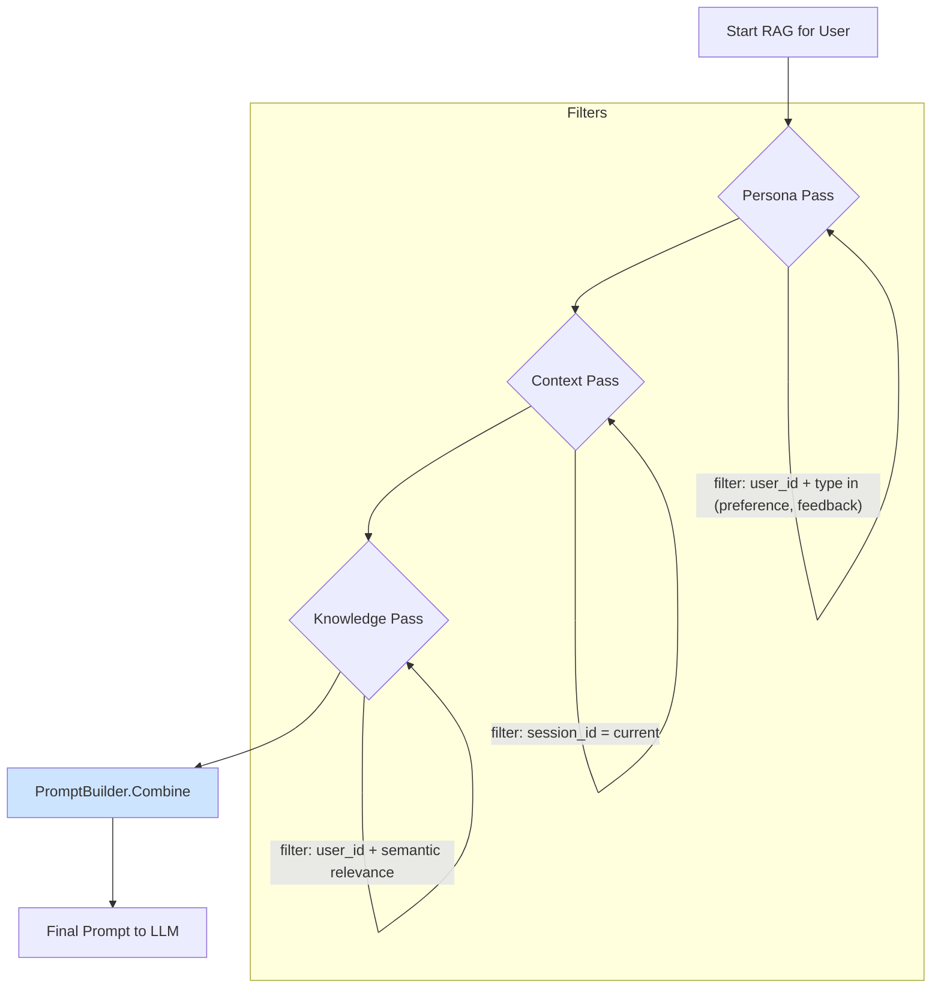

# ADR 001: Hybrid Memory, Personalization, and Proactive Intelligence Framework

**Status**: Proposed
**Date**: 2025-06-26
**Decision Makers**: Roo (Architect), o3 (Planner)

## Context

PCAS 当前拥有基于向量的 RAG（检索增强生成）能力，但缺乏利用结构化元数据进行精确过滤的能力。为了支撑更高级的 DApp 场景，如个性化对话和主动提醒，我们需要一个能够结合语义相似度和精确元数据过滤的“混合记忆”系统。

本项目旨在设计并实施一个能够实现长期个性化（Persona）、短期上下文（Session）和主动智能（Proactive Triggers）的统一框架。

## 决策

我们将通过升级存储层、扩展查询接口、并引入新的后台服务，来实现一个高性能、可扩展的混合记忆和个性化框架。

### 1. 总体设计

| 维度 | 解决思路 | 关键实现点 |
| :--- | :--- | :--- |
| **Persona (长期偏好)** | 专用事件类型 `pcas.user.preference.v1` / `pcas.user.feedback.v1` | 写入时带 `user_id`，向量端存精选元数据；检索时先做 **Filter-Only** 查询拿到 ≤50 条，再按相似度重排 |
| **Session (短期上下文)** | 所有对话事件绑定同一 `session_id` | RAG 第一轮直接 `WHERE session_id = $current`，保证“刚聊过就能想起” |
| **Proactive Triggers** | 后台 **Daemon-Runner** 子系统 | Goroutine 或 CronJob；对 `events` 与 `vectors` 做计划性扫描，命中后生成系统事件再走 LLM 润色 |
| **Prompt 构建** | 三段式<br>① System Persona ② Context Chunks ③ User Prompt | Builder 模块负责拼接；对长文本做 chunk-dedupe 与 token 预算 |

### 2. 事件与 Proto 扩展

我们将创建新的 `.proto` 文件来定义用户偏好和反馈事件。

```protobuf
// proto/pcas/events/v1/user.proto
syntax = "proto3";

package pcas.events.v1;

import "google/protobuf/timestamp.proto";

option go_package = "github.com/soaringjerry/pcas/gen/go/pcas/events/v1;eventsv1";

message UserPreferenceV1 {
  string id          = 1;  // UUID
  string user_id     = 2;
  string category    = 3;  // "tone" | "length" | ...
  string value       = 4;  // "humorous" | "concise" | ...
  google.protobuf.Timestamp time = 5;
}

message UserFeedbackV1 {
  string id       = 1;
  string user_id  = 2;
  string target_event_id = 3;   // 被评价的回答
  int32  rating   = 4;          // -1 / 0 / +1
  string comment  = 5;
  google.protobuf.Timestamp time = 6;
}
```

### 3. 存储层调整 (PostgreSQL + pgvector)

1.  **生成列与索引**: 为了实现高性能过滤，我们将向 `pcas_vectors` 表添加生成列和索引。

    ```sql
    -- Migration Script
    ALTER TABLE pcas_vectors
      ADD COLUMN IF NOT EXISTS user_id       text GENERATED ALWAYS AS (metadata->>'user_id') STORED,
      ADD COLUMN IF NOT EXISTS session_id    text GENERATED ALWAYS AS (metadata->>'session_id') STORED,
      ADD COLUMN IF NOT EXISTS event_type    text GENERATED ALWAYS AS (metadata->>'event_type') STORED,
      ADD COLUMN IF NOT EXISTS event_ts      timestamptz GENERATED ALWAYS AS (to_timestamp((metadata->>'timestamp_unix')::bigint)) STORED;

    CREATE INDEX IF NOT EXISTS idx_pcas_vectors_user_event_type ON pcas_vectors USING btree (user_id, event_type);
    CREATE INDEX IF NOT EXISTS idx_pcas_vectors_event_ts ON pcas_vectors USING brin (event_ts);
    ```

2.  **QuerySimilar 接口**: 存储层的查询接口将更新，以接受一个结构化的过滤器对象。

    ```go
    // internal/storage/provider.go
    type VectorStorage interface {
        // ...
        QuerySimilar(ctx context.Context, queryEmbedding []float32, topK int, filter *Filter) ([]QueryResult, error)
    }

    // Filter struct to be defined, capable of generating complex WHERE clauses
    type Filter struct {
        // ...
    }
    ```

### 4. Prompt Builder 流程



### 5. Daemon-Runner 子系统

一个后台服务将运行多个守护进程，用于主动触发智能。

| 守护进程 | 触发条件 (SQL/向量) | 生成事件 |
| :--- | :--- | :--- |
| **Daily Digest** | `WHERE event_ts >= now()-'24h' AND user_id=$1` | `pcas.system.digest.v1` |
| **Interest Spike** | 最近 3 d 内同一 `subject` 出现 ≥ N 次 | `pcas.system.suggestion.v1` |
| **Deadline Reminder** | `subject ~ '启动' AND event_ts = T-1d` | `pcas.system.reminder.v1` |

### 6. 实施节奏

| Day | 里程碑 |
| :--- | :--- |
| 1 | proto & event types + StoreEmbedding metadata |
| 2 | QuerySimilar 过滤 + 生成列 & 索引迁移脚本 |
| 3 | PromptBuilder 三段式 + CLI `--filter` |
| 4 | Daemon-Runner 框架 + DailyDigest PoC |
| 5 | 回填脚本 + 文档 / ADR |

## 后果

**正面**:
*   极大增强 PCAS 的能力，使其从被动的记忆库演变为主动的智能助手。
*   为开发高级、个性化的 DApp 奠定坚实的技术基础。
*   查询性能将通过索引得到保障。

**负面**:
*   增加了系统复杂性。
*   需要一次性的数据迁移和回填操作。
*   对 DApp 开发者提出了更高的要求，需要理解和使用新的过滤机制。