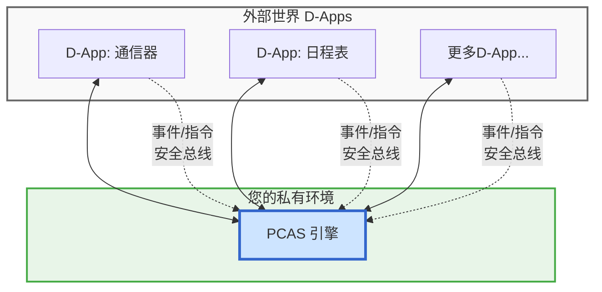

# PCAS Architecture Overview

**Document Note:** This document is the final technical blueprint for the **PCAS (Personal Central AI System)** project. It aims to be the core guideline for the future development of the PCAS engine and its ecosystem for years to come. PCAS is the core technical implementation of the broader **DreamHub** vision.

---

## 第一部分：顶层设计与核心原则 (The "Why")

### 1.1. 核心原则: 数据绝对私有，计算灵活调度
这是我们整个架构的基石，也是我们对用户的核心承诺。
*   **数据绝对私有**: PCAS作为一个软件，被部署在用户的**私有环境**中（个人电脑、家庭服务器、私有云等）。所有核心数据，特别是敏感的个人数据，永远不会离开这个环境。
*   **计算灵活调度**: 在数据不离开私有环境的前提下，PCAS可以根据用户设定的策略，智能地选择本次AI计算任务的执行方式。

### 1.2. 三大计算模式 (Compute Modes)
基于核心原则，用户可以根据自己的需求，在成本、性能和隐私之间做出选择：
1.  **本地模式 (Local Compute):** 所有AI计算均在用户的私有环境中，由本地模型（如Ollama）完成。实现极致的隐私保障。
2.  **混合模式 (Hybrid Compute):** PCAS核心内置“策略引擎”，根据用户规则（如任务复杂度、数据敏感度）动态决定是使用本地模型，还是调用外部云端AI API（如OpenAI）。
3.  **云端模式 (Cloud Compute):** 默认所有AI计算都调用外部云端API，以获取最强算力。

### 1.3. 终极愿景: 从数据熔炉到个人AI
PCAS的终极目标，是成为一个**数据熔炉**，帮助用户拥有并掌控一个完全属于自己的、高质量的私有数据集。最终，用户将可以使用这个独一无二的数据集，去微调甚至训练一个真正懂自己、只为自己服务的个人AI模型。

### 1.4. 社会理想: 建立开放生态与标准
我们致力于构建的，不只是一个开源软件，更是一个繁荣的、开放的生态系统。我们将积极建设一个由开发者和用户组成的全球社区，并致力于让PCAS的通信协议和数据管理方式，成为未来个人AI领域的一个开放标准。

---

## 第二部分：核心架构与技术设计 (The "What")

### 2.1. 核心定位: “个人决策中心”
PCAS 的定位不是一个像 Dify 那样的通用“应用构建平台”，而是一个部署在用户私有环境中的“**个人决策中心**”。一个绝佳的类比是：**英国签证的“UKVI决策中心”**。它的核心价值在于其自身的**决策与实时规划能力**。

### 2.2. 架构模型: 智能事件总线
PCAS 的架构是一个以它为中心的、网状的、事件驱动的协作网络。

### 2.3. 核心记忆模型: 数据熔炉之基石
为了捕获并关联所有交互、决策与反馈，我们设计了一个基于**图（Graph）**的统一数据模型。
*   **设计思想:** 将系统中的每一个关键“物件”（事件、决策、指令、结果、反馈）都视为图中的一个**节点(Node)**，将它们的因果关系视为图中的一条**边(Edge)**。
*   **实现方案:** 在用户选择的存储后端（SQLite或PostgreSQL）中，用`nodes`和`edges`两张核心表来模拟实现这个图模型。
*   **性能保障:** 通过**索引、缓存、数据归档、架构演进预案**四层策略，确保模型在海量数据下的查询性能。

---

## 第三部分：架构风险与缓解策略 (The "How to be Safe")

### 3.1. 风险一：事件协议稳定性
*   **缓解策略:** 采用 **Protobuf** 定义事件结构，强制包含 `version` 字段，并兼容 **CloudEvents v1.0** 核心字段。

### 3.2. 风险二：决策引擎复杂度
*   **缓解策略:** 采用“**规则引擎**+**LLM推理引擎**”的分层决策架构，并为所有LLM决策生成**可解释性日志**。强制每条事件附带`trace_id`，并接入**OpenTelemetry**。

### 3.3. 风险三：安全与权限
*   **缓解策略:** 采用**零信任安全模型**。事件总线作为“安全总线”，强制检查每个D-App出示的**能力令牌 (Capability Tokens)**（V1阶段以JWT+Scope实现）。

### 3.4. 风险四：状态持久化
*   **缓解策略:** 提供**可插拔的`StorageProvider`**（默认SQLite+本地向量库，可选PostgreSQL+pgvector）。

### 3.5. 风险五：多端同步
*   **缓解策略:** **V1阶段**专注于强大的单节点体验。**V2阶段**将引入专门的同步服务（如NATS JetStream）。

---

## 第四部分：前瞻性方向与长期愿景 (The "What's Next")

*   **PCAS联邦网络 (V2):** 实现PCAS之间的去中心化协作。
*   **行为-反事实日志:** 让PCAS拥有“复盘”能力，实现自监督学习。
*   **本地模型编排:** 让PCAS成为“本地算力指挥家”。
*   **“收据式”数据主权UI:** 让“数据主权”变得可触摸、可验证。
*   **事件层回滚与补偿:** 引入Saga模式，为高风险操作提供撤销能力。
*   **端到端加密与备份:** 默认整库加密，并提供一键加密备份到自托管存储的功能。

---

## 第五部分：近期执行清单 (Sprint-4)

**核心原则: 先建好高速公路，再让各种跑车在上面飞驰。**

本清单由规划师 o3 于 2025-06-25 制定，作为项目完成核心功能验证后，进入下一阶段（代号 S4）的行动纲领。它将取代旧的落地清单，成为我们近期的唯一权威参考。

*（时间线以 2025-07-01 为基准，可根据实际推进调整；❗ = 完成前无法进入下一步）*

| 优先级      | 截止         | 任务                                                                                                                                  | 负责人        | 验收标准                                                    |
| -------- | ---------- | ----------------------------------------------------------------------------------------------------------------------------------- | ---------- | ------------------------------------------------------- |
| ❗ **P0** | **立即（今天）** | 1. **推送当前代码到 `origin` 并跑 CI**                                                                                                       | Jerry      | `ci.yml` 全绿：`make proto`、`go vet`、单测通过                  |
| ❗ **P0** | 今日         | 2. **创建 Sprint-4 看板**（GitHub Project）  • 列出 3 个 Issue：   · Bus 内存实现   · ComputeProvider 骨架 + MockProvider   · 一键 Dev 脚本 | Jerry         | Issue 写清 *验收条件* & *Owner*                               |
| ❗ **P0** | +3 天       | 3. **完成 `internal/bus/memory` + 单元测试**                                                                                              | Jerry      | 发布→订阅 p95 延迟＜20 ms；`go test ./internal/bus/...` 100 % 绿 |
| ❗ **P0** | +5 天       | 4. **实现 `ComputeProvider` 接口 + MockProvider**                                                                                       | Jerry      | `MockProvider.Infer()` 返回固定结果；接口注释齐全                    |
| P1       | +6 天       | 5. **策略引擎最小版本**：`policy.yaml` 能把 `pcas.echo` 路由到 MockProvider                                                                       | Jerry         | 发送 echo 事件 → 收到 echo 结果                                 |
| P1       | +7 天       | 6. **一键 Dev 脚本／Compose**：`make dev-up` 拉起 Chroma + PCAS                                                                             | DevOps Lee | 新人从零跑通 Quick-Start ≤ 15 min                             |
| P1       | +9 天       | 7. **编写 Quick-Start 校验脚本**；CI 中自动跑 demo 流程                                                                                          | Jerry         | GitHub Actions 15 min 内完成 e2e                           |
| P2       | +10 天      | 8. **撰写 “Hello D-App” 教程草稿**（≤100 行示例代码）                                                                                            | Jerry         | 新人按文档能建 D-App 并打印事件                                     |
| P2       | +14 天      | 9. **OllamaProvider PoC**（本地 Llama 3-8B 推理）                                                                                         | Jerry      | 512 token 推理耗时 ≤ 3 s                                    |
| P2       | +14 天      | 10. **发布 tag `v0.0.1`（Pre-MVP Tech Preview）**                                                                                       | Jerry         | Release Notes 声明“API 不稳定”，Docker 镜像 `:0.0.1` 推送成功       |

> **说明**
> *P0*：不完成无法继续开发；*P1*：MVP 必需；*P2*：增强体验、吸收外部反馈。
> 完成第 1-7 项时，即可宣布 **“Bus / Provider 骨架就绪”**，进入 D-App 编写阶段；完成第 1-9 项基本满足 **MVP (v0.1.0-beta)**；第 10 项是提前占位、收早期反馈。
