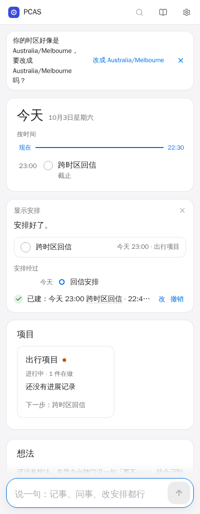
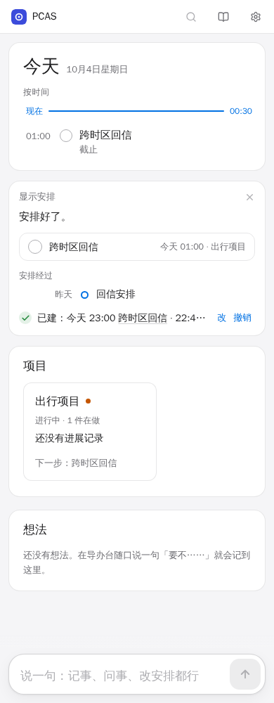

# F8：跨页面工作区时区显示验收

2026-10-01。基线 `c94b496`，分支 `fix/timezone-displays`。执行者接手并验证了协调者留下的 66 行测试草稿，新增独立回归后才修改产品实现。没有合并或部署。

## 观察与修复

浏览器 `Australia/Melbourne`、工作区 `Asia/Shanghai`、现在 `2026-10-03T14:30:00Z`、截止 `2026-10-03T15:00:00Z`。未修实现的实际值：

| 入口 | 预期 | 观察到的错误 |
|---|---|---|
| 首页 | `23:00` | 正确 |
| 秘书任务卡片 | `今天 23:00` | `今天 01:00` |
| 来源时间线 | `今天` | `昨天` |
| 事项信息行 | `今天 23:00 截止`、`22:45 提醒` | `今天 01:00 截止`、`00:45 提醒` |
| 项目任务列表 | `今天 23:00 截止` | `今天 01:00 截止` |
| 等待事项的项目分组 | `等对方回复 · 明天跟进` | `该跟进了：对方还没回` |
| 临近截止的项目分组 | `明天截止` | `今天 23:30 截止` |

独立扩展的修复前用例共 8 项，4 失败、4 通过。两种宽度都复现全部跨页面显示问题；另有上海跨年日期失败。修复前跨年检查通过浏览器直接加载时间模块，最终改为渲染秘书卡片的字面日期断言，使同一预期也能验证正式构建产物。失败日志保留在 `/tmp/pcas-f8/before-expanded.log`，含上述实际值与 trace；初次启动失败的环境错误没有计入回归证据。

修复集中在原有 `time.ts`：按传入时区计算日历日、日期字段、星期、年份和时钟；复用短日期、事项信息行和完整时间戳的现有文案风格。所有活跃入口显式传入 `state.settings.timezone ?? 'UTC'`，没有可变全局时区。项目 `urgentLine` / `ongoingLine` 的跟进和截止判断使用相同日历。

覆盖任务卡片、来源卡片/时间线、事项截止和提醒、项目任务列表、事项/首页/资料库相对时间的具体日期退路，以及来源原文记录时间、接入最近同步和账户额度重置时间。未改布局、后端、UTC 存储、提醒解释或历史回执。

## 验收序列

| 编号 | 已通过证据 |
|---|---|
| Z1 | 墨尔本浏览器、上海工作区：同一事项在首页、卡片、详情和项目列表一致；提醒 `22:45`；来源时间线 `今天`。 |
| Z2 | 切换墨尔本后各动态显示更新，刷新与逐页访问保持一致；mock 和真实后端均断言 UTC due / nextAt 不变、历史回执逐字不变。 |
| Z3 | 墨尔本春季 23 小时日、秋季 25 小时日；同一瞬间在上海为 12 月 31 日、墨尔本为 1 月 1 日；具体日期、星期、跨年年份正确。额外覆盖春季跳时两侧的提醒 `01:45` / 截止 `03:15`。 |
| Z4 | 项目等待跟进、临近截止与首页使用同一日历；切换设置前后分组和日期文案正确。 |
| Z5 | 桌面 1440 与手机 390 均重复 Z1/Z2；刷新后历史回执只有一条；前端 pageerror 数组为空；保存两时区截图。 |

## 验证命令与结果

Node 使用 `/root/.nvm/versions/node/v22.23.3/bin`，没有改变系统默认版本。

- `make check`：通过（fmt-check、go vet、race 单元测试、Go 构建）。无数据库产品改动，未另跑全量 PostgreSQL 集成测试。
- `cd web && npm run lint && npm run type-check && npm run build`：通过；最终新增测试后再次 lint / type-check 通过。
- 正式构建产物、临时 API 上运行 `npx playwright test tests/timezone.spec.ts tests/secretary.spec.ts tests/fixes.spec.ts tests/notify.spec.ts tests/buttons.spec.ts`：54/54 通过。之后新增三项跨日提醒/缺省 UTC 检查，最后在 Vite preview 正式构建产物上运行完整 `tests/timezone.spec.ts`：18/18 通过、零 skip。
- 在独有 tmpfs PostgreSQL 上，复制既有 `real-backend.sh` 到本任务临时目录，只调整固定工作目录、F8 容器名和端口，运行补强的 `tests/timezone-backend.spec.ts`：1/1 通过、零 skip。

真实后端覆盖首次登录时区、保存/校验、提示、秘书创建与读取真实卡片、四页面切换、刷新、UTC 字段和历史回执；外部模型及通知服务为本地假服务。mock 覆盖两种视口、夏令时/跨年/提醒跨日、项目跟进、来源及设置附属时间入口，并通过具体文案与错误计数断言。此次没有真实模型账户、设备推送、Telegram 或生产渠道验收，也未替代 T2/A1。

## 完整真实后端 CI 补验

原提交 `bddc14b` 的[完整真实后端 CI](https://github.com/soaringjerry/PCAS/actions/runs/36823487398/job/110243927563) 实际失败：timezone 1/1、其余 backend 4/4 通过；golden 21/27 通过，G1/G3 各重复三次都在项目 ID 断言失败。此前的专项 1/1 证据没有覆盖这一共享数据问题。

在独有 `pcas-test-F8-CI-*` tmpfs PostgreSQL、HTTP 18139、真实 API/worker 上，先连跑未修测试的 timezone 与 G1/G3 三重复：timezone 1/1 通过，G1/G3 6/6 失败。真实 workspace 中 F8 项目 `2be7aa4a-761b-4977-9797-d40d57064f83` 仍为 active，A 项目是 `d40daedc-baa1-4c05-ada0-db6ab4d20cd2`；六个 golden 事项的实际 projectId 全部是前者。秘书按 `created_at,id` 顺序为 active 项目分配别名，先创建的 F8 项目占据 P1，而 golden 假模型使用固定 P1 并要求对应 A。根因是本用例遗漏项目收尾；不是时区产品显示回归或共同环境故障。

只修改 F8 用例的数据生命周期：项目使用本用例生成的 UUID，从本次创建回执的 thingId 记录事项 ID，按 ID 从回执对应 state 取事项并验证标题；在 `finally` 中仅将这些事项和项目置为 done，并恢复 followUps。原有时区、UTC 数据、四页面和历史回执断言全部保留，增加项目归属与收尾状态断言。这里是结束测试项目使其退出 active 别名集合，不是物理删除。golden、共享 fixture、runner 和产品代码没有此次改动。

修复后的真实 workspace 确认 F8 项目和两事项为 done；直接只读查询秘书使用的同序 active 项目集合，P1 已对应 A（`327a1947-07f5-454d-896b-7cc1b1687bd5`）。使用既有 `real-backend.sh` 的临时隔离副本执行完整默认序列：timezone **1/1**、golden 三重复 **27/27**、其余 backend **4/4**，共 **32/32** 通过；三个 JSON 报告均为 skipped / unexpected / flaky = 0。golden 耗时 618.4 秒，涵盖真实提醒等待和模型超时保存。运行副本只调整工作目录、F8 容器名、HTTP 18139 和独立回调端口，并在阶段间加只读证据输出；测试列表、三重复和断言未改。

完整运行加载的是 `finally` 收尾修复版本，事项仍按原固定标题在本轮 state 中定位。随后审查将两处定位改为本次创建回执的 thingId，并保留标题的精确断言；最终版本在另一个新鲜 tmpfs 工作区专项 **1/1** 通过，零 skip / unexpected / flaky。最终 lint / type-check 通过；此前正式构建通过，最后的小改只涉及测试选择器。没有宣称对最终选择器小改重跑本地完整套件；最新推送提交的远端 CI 另行查询。

[补验精简证据](2026-10-01-timezone-displays/ci-followup.txt) 保留一条原始失败断言、项目 ID/别名变化、完整 32 次通过记录和最终专项。完整 JSON/截图在本机 `/tmp/pcas-f8-ci/full-results`，原始日志在同目录。三个自建 `pcas-test-F8-CI-*` 容器和九个记录的服务 PID 均已退出/删除；记录的运行目录已删除，18138/18139 无监听。runner 用 `docker rm -fv` 清理自身容器/卷，仅停止自己记录的 PID。保留日志和截图供审查；本次外部模型和通知仍使用本地假服务，未合并或部署。

## 证据与资源

远端可审阅的[精简验证记录](2026-10-01-timezone-displays/verification.txt)与截图：

| 视口 | 上海工作区 | 墨尔本工作区 |
|---|---|---|
| 桌面 1440 | [上海截图](2026-10-01-timezone-displays/desktop-shanghai.png) | [墨尔本截图](2026-10-01-timezone-displays/desktop-melbourne.png) |
| 手机 390 | [上海截图](2026-10-01-timezone-displays/mobile-shanghai.png) | [墨尔本截图](2026-10-01-timezone-displays/mobile-melbourne.png) |

手机切换前后：

原始日志和真实后端截图保留在本机 `/tmp/pcas-f8`：

- `before-expanded.log`：修复前独立失败。
- `mock-final.log`、`timezone-final.log`、`real-final.log`、`make-check.log`：通过日志。
- `timezone-final/timezone-workspace-timezon-e2fca-tails-and-project-at-1440px/{shanghai,melbourne}.png`：桌面两时区。
- `timezone-final/timezone-workspace-timezon-be507-etails-and-project-at-390px/{shanghai,melbourne}.png`：手机两时区。
- `real-final`：真实后端截图与附件。

临时 API 使用 18139，开发/preview 使用 18138。真实 runner 已删除自己的 `pcas-test-F8-*` tmpfs 容器、卷和运行目录，停止记录的 fixture/API/worker 进程；preview 已在完成最终测试后停止。保留约 12 MB 的日志、截图和失败 trace 供审查。生产容器、其他任务目录和默认模型账户均未连接或变更。

未使用的 DateTimePicker 按任务要求留在范围外。未发现需要扩大文件归属或新增后端契约的事项。
