# U1：首页、事项页与回执的体验打磨

2026-10-01。基线 `2e6ebc1`（F8 / PR #23 候选），分支 `stabilization/U1-ux-polish`，PR base `fix/timezone-displays`。执行者 Opus 5.5。没有合并或部署。

走查用正式构建产物（`npm run build` + `vite preview`，端口 18142），所有 `/v1` 请求在浏览器内用合成数据应答，没有连接后端、模型、邮件、Telegram 或任何真实账户。两种视口：桌面 1440×900、手机 390×844。

## 走查发现（按影响排序）

先走查、后实现。下表前四列是动手之前写下的清单；「处理」一列在实现后补上。

| 编号 | 路径 | 观察到的问题 | 归属 | 处理 |
|---|---|---|---|---|
| U1-1 | 事项页 → 对秘书说一句 | 页面内容超过一屏时，回执落在固定输入框的背后：桌面回执顶边 866px、输入区顶边 824px；手机 809px 对 768px。回执上的【撤销】按钮中心点被输入区盖住，点不到。用户说完一句看不到任何结果，要自己往下滚。 | 前端可修 | 已修 |
| U1-2 | 首页 → 说一句安排 → 回执（手机） | 390px 下回执被截成一行：`已改：交房租 …` 把改成的时间切掉，撤销失败的原因只剩「这件事之后又改过…」，跳过的原因也被切掉。手机上没有悬停提示，没有办法看全。4 条回执里 3 条被截，失败原因 207px 只显示 127px。 | 前端可修 | 已修 |
| U1-3 | 首页时区提示 | 同一个时区名出现三次，却没有说当前设置是什么；手机上占 5 行、116px，把「今天」往下推。 | 前端可修（文案调整已由协调者授权） | 已修 |
| U1-4 | 连续发送（手机首页、事项页的折叠对话） | 第一句还在「正在想…」时再发一句，第一句整行消失，只剩最新一句；用户分不清前一句是在处理还是丢了。失败的那句会留着，处理中的不会。 | 前端可修 | 已修 |
| U1-5 | 事项页 → 动态（手机） | 修改记录被截成一行且没有展开方式：`截止时间从周五 15:00 改到今天 15:30…` 后半句（提醒怎么改的）看不到，505px 的文字只显示 258px。旧版文字的说明行同样会被截。 | 前端可修 | 已修 |

记录但本批不改：

| 编号 | 观察 | 不改的原因 |
|---|---|---|
| U1-6 | 手机上文档行的标题只拿到约一半宽度（328px 的标题显示 157px），展开后正文也不再重复标题。 | 影响小于上面五项；点开即可读正文。留给下一批。 |
| U1-7 | 引用的原文已删除时，侧栏显示「记录已不存在，请刷新后重试。」，刷新并不能解决。 | 文案在 `store/api.ts` 的公共错误表里，不在本任务文件归属内；需要协调者决定是改公共文案还是在来源侧栏单独处理。 |
| U1-8 | 点引用打开来源侧栏后，原文默认收在「展开原文」里，要再点一次。 | `backend.spec.ts`、`golden.spec.ts` 以点击「展开原文」为既有行为断言，这两个文件不属于本任务；改默认状态需要协调者确认。 |
| U1-9 | 折叠对话里，较早一句的回答晚到时不会显示（只显示发送顺序上的最后一句）。 | 属于「只显示最近一轮」的既定取舍，改它等于重新定义折叠规则。 |
| U1-10 | 秘书请求被服务端拒绝时显示「内容或状态不符合要求，请检查输入。」，没说哪里不符合。 | 文案来自服务端错误码的公共映射，属后端 / 公共错误表。 |
| U1-11 | 桌面上标题很长的回执仍是一行，改成的时间会被省略号盖住，只能靠悬停看全。 | 原则写的是「回执一行说清」，桌面有悬停提示；是否在桌面也换行需要协调者决定。 |

走查中没有发现问题的部分：空白工作区的三块空状态文案清楚且不溢出；长标题在首页、事项页标题、项目内事项列表都正常换行；桌面三栏布局、失败行的【重试】【改】、撤销后的「已撤销」状态、项目 → 事项 → 返回的层级都正常；全部场景两次走查的前端 `pageerror` 均为空。

## 问题 → 调整 → 证据

### U1-1 事项页的回执停在输入框上方

- 调整：`secretary.css` 给事项页的对话行加 `scroll-margin-bottom: 100px`，新回执滚入视野时停在固定输入区之上。首页手机版原本就有同样的规则，事项页漏了。
- 结果：桌面回执 771–801px、输入区顶边 824px；手机 655–747px、输入区 768px；【撤销】按钮中心点命中按钮自身。
- 截图：

| | 调整前 | 调整后 |
|---|---|---|
| 桌面 1440 | 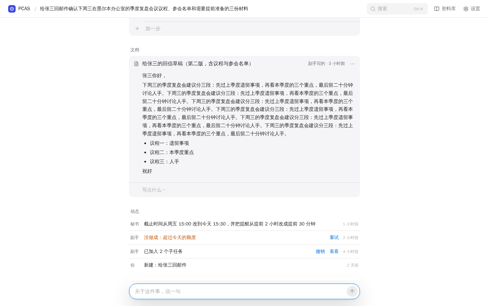 | 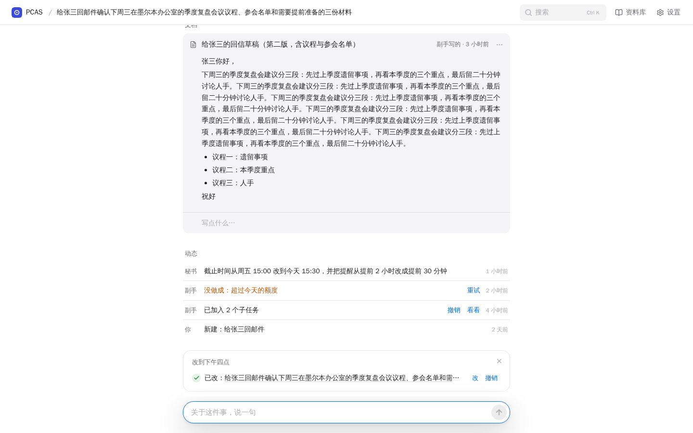 |
| 手机 390 | 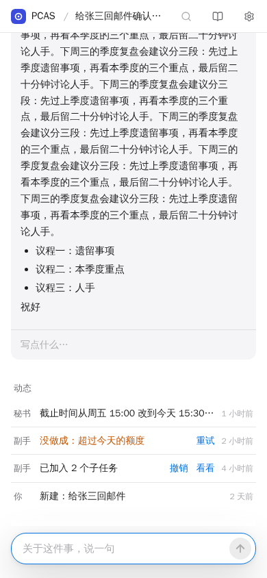 | 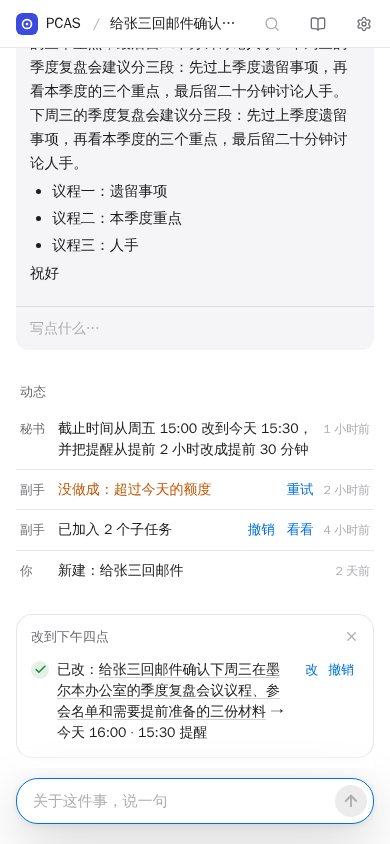 |

### U1-2 手机上的回执能看全

- 调整：`secretary.css` 在 860px 以下让回执文字换行；撤销失败的原因单独占回执下面一行；【改】【撤销】留在回执第一行右侧。桌面不变（调整前后截图逐字节相同）。
- 结果：手机上 4 条回执和失败原因都不再被截。
- 截图：

| 调整前（手机） | 调整后（手机） | 调整后（桌面，未变） |
|---|---|---|
| 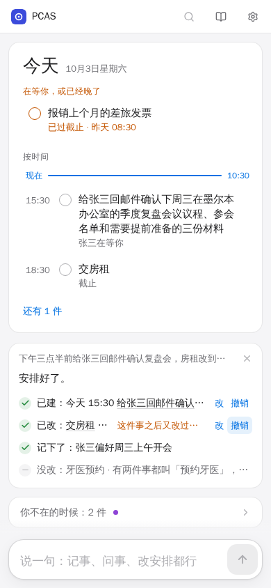 | 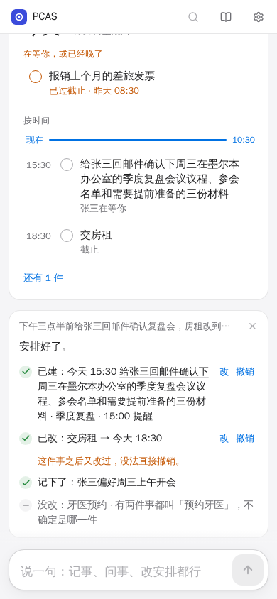 | 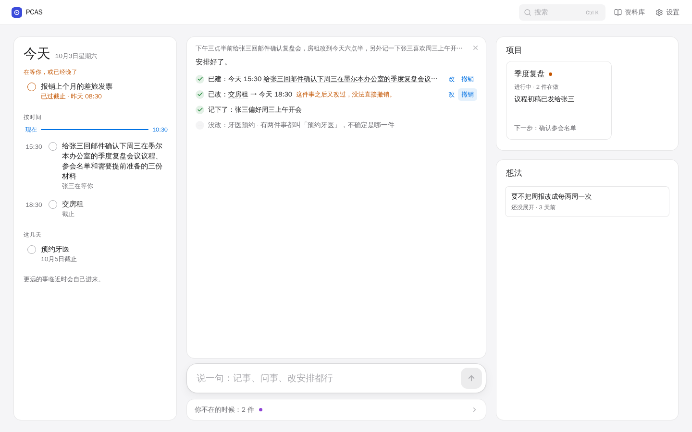 |

### U1-3 时区提示更短，并说明当前设置

文案旧 → 新：

| | 旧 | 新 |
|---|---|---|
| 提示句 | 你的时区好像是 Australia/Melbourne，要改成 Australia/Melbourne 吗？ | 时间按 Asia/Shanghai 显示，和这台设备不同 |
| 切换按钮 | 改成 Australia/Melbourne | 改成 Australia/Melbourne（未变） |
| 关闭按钮 | ×，读屏名称「关闭时区提示」 | 未变 |

- 提示句现在说的是工作区当前使用的时区（未设置时为 UTC），设备时区只在按钮上出现一次。
- 保留的行为：只在设备时区与工作区不同时出现；用户点按钮才切换；点 × 后同一浏览器不再提示。`TimezoneHint.tsx` 只改了提示句，判断、命令和存储键都没动。按钮名称没变，所以不属于本任务的 `timezone-backend.spec.ts` 无需改动。
- 布局：`hall.css` 在 860px 以下改成两行，提示句在上、切换按钮在下、× 在右上。手机高度 116px → 66px，「今天」上移 50px。桌面仍是一行。
- 下游文档：`docs/tasks/phase1/postlaunch.md` 第 47 行仍引用旧提示句，该文件归协调者，未改。
- 截图：

| | 调整前 | 调整后 |
|---|---|---|
| 桌面 1440 | 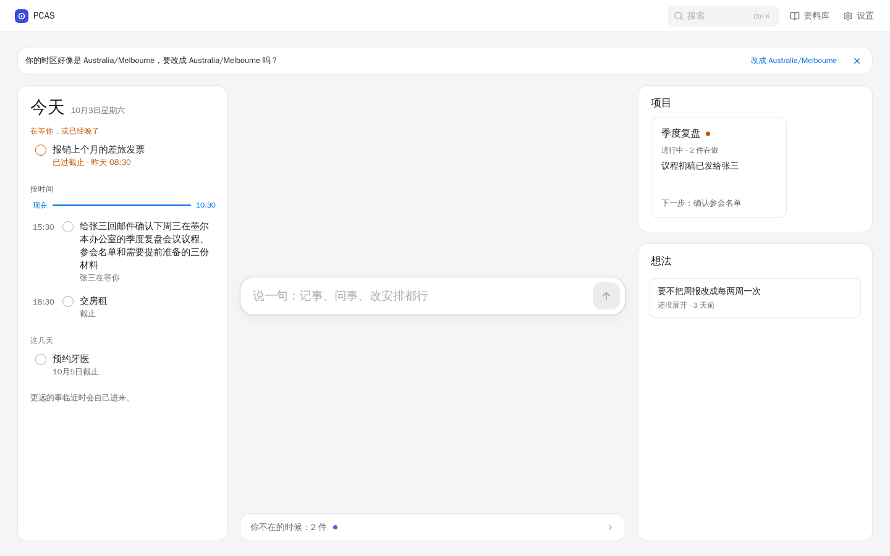 | 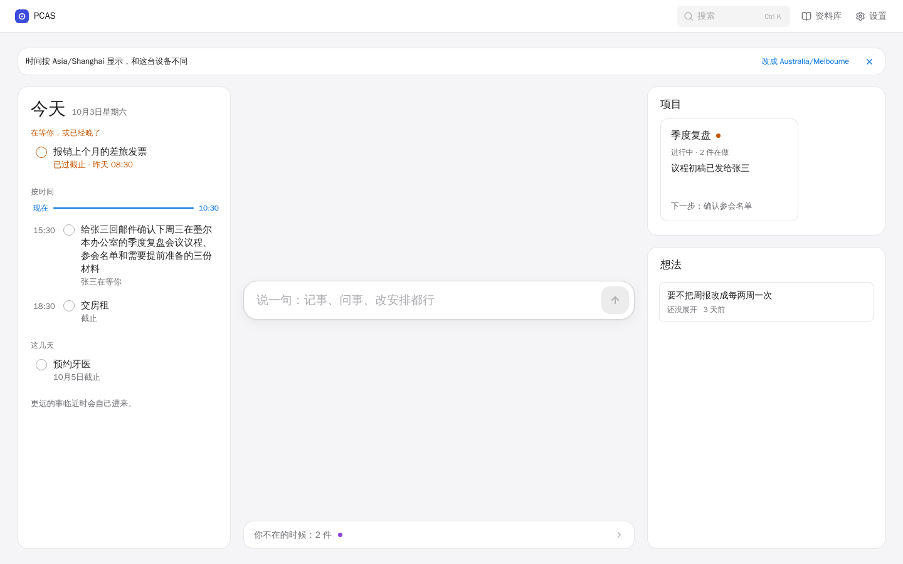 |
| 手机 390 | 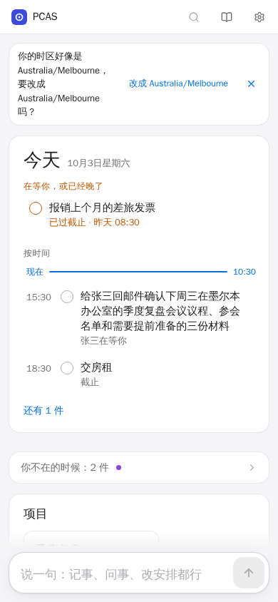 | 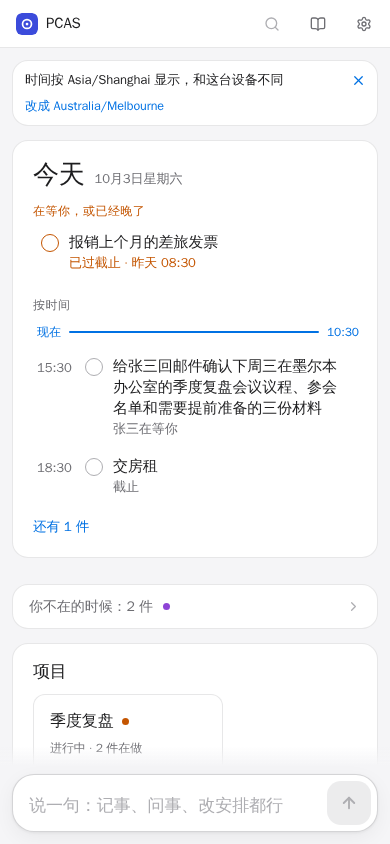 |

### U1-4 折叠对话里，还在处理的那句不消失

- 调整：`Secretary.tsx` 折叠时除了最新一句，也保留所有还没有回答的句子（原来只保留失败的）。回答到了以后照旧折进「展开对话」。
- 影响范围：手机首页和事项页的折叠对话；桌面首页是完整对话，调整前后截图逐字节相同。
- `web/README.md` 里「秘书只显示最近一轮」的说法仍然成立，只是没回答的句子会多留一会儿；该文件不属于本任务，未改。
- 截图（手机）：

| 调整前 | 调整后 |
|---|---|
| 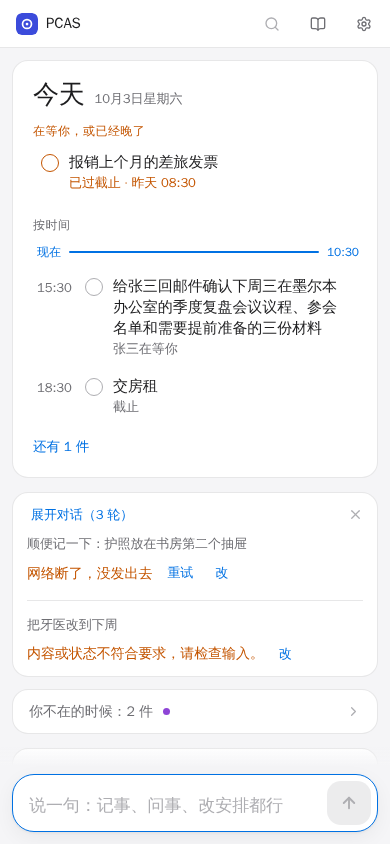 | 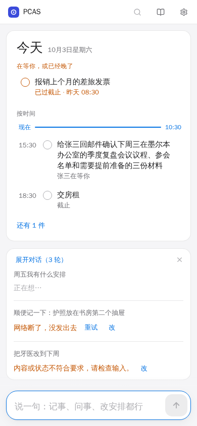 |

### U1-5 动态里的修改记录换行显示

- 调整：`thing.css` 让纯记录行（没有【看看】可展开的那种）换行；副手结果行带按钮，仍是一行。
- 结果：手机上记录完整显示为两行；桌面这一行本来就放得下，调整前后截图逐字节相同。
- 截图（手机）：

| 调整前 | 调整后 |
|---|---|
| 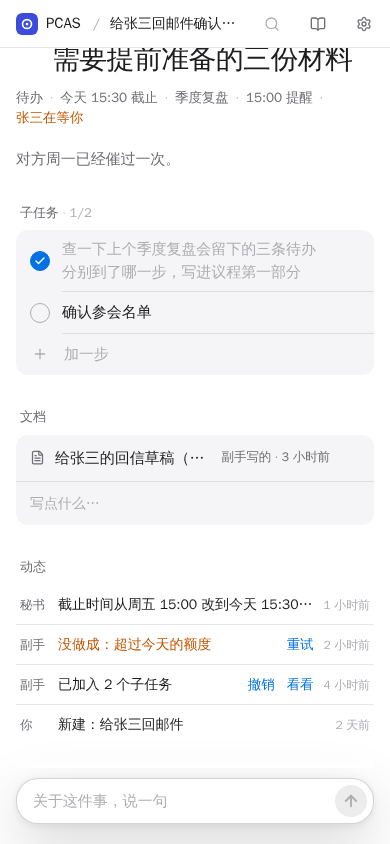 | 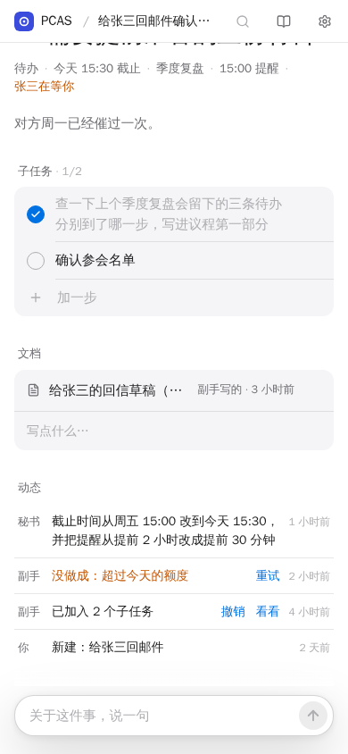 |

## 验证

Node `v22.23.3`，依赖用本工作区的 `npm ci` 安装。原始记录摘录见 [verification.txt](2026-10-01-ux-polish/verification.txt)。

| 检查 | 结果 |
|---|---|
| `npm run lint` | 通过 |
| `npm run type-check` | 通过 |
| `npm run build` | 通过 |
| 未改动的基线构建 + 原测试：`secretary` `fixes` `notify` `buttons` `timezone` | 57 / 57 通过 |
| 未改动的基线构建 + 本次更新后的 `secretary` `buttons` `timezone` | 38 通过、7 失败。失败的正是 5 个新增用例和 2 个更新过的时区提示用例，说明它们能测出原问题 |
| 修复后的构建 + 同样五个文件 | 62 / 62 通过，零 skip |
| `git diff --check` | 通过 |

测试改动：

- `secretary.spec.ts` 新增 4 个用例：事项页回执不被输入区遮挡（1440、390 各一）、手机回执不被截且失败原因在回执下方、折叠时处理中的句子仍可见。
- `buttons.spec.ts` 新增 1 个用例：手机上动态的修改记录换行且不溢出。
- `timezone.spec.ts`：提示句断言从旧文案换成新文案，并断言设备时区名在提示里只出现一次；手机用例增加「切换按钮在提示句下方、× 在其上方」的布局断言。原有的位置、一键切换、命令内容、关闭后持久、别名不提示、历史回执等断言全部保留。

没有运行的检查：

- 接真实后端的 `timezone-backend`、`golden`、`backend`、`continuity`、`chatgpt-direct`、`model-api` 没有在本地运行；本次没有改后端、API 类型或这些测试文件，时区提示的按钮名称和关闭按钮名称未变。它们由 PR 的远端 CI 覆盖，结果以 CI 为准。
- `make check`（Go）没有运行，本次没有 Go 改动。
- 没有真机验证。手机结论来自 390px 视口的桌面 Chromium，软键盘弹出时的遮挡情况没有覆盖。

## 局限

- U1-1 的 100px 是按单行输入框的高度留的；输入框里有多行草稿时发送后会清空，所以回执到达时输入区已回到单行。
- U1-2 只按宽度判断（860px 以下）。宽屏触摸设备仍是一行加悬停提示，见 U1-11。
- 截图和测试用的是合成数据，回执文字是按现有格式写的样例，不是模型的真实输出。

## 资源

- 预览只用了 18142；先后启动过三个 `vite preview` 进程（修复前构建、基线对照、修复后构建），都由本任务记录 PID 并自行停止。
- 基线对照用 `git archive 2e6ebc1 web` 导出到 `/tmp/pcas-u1-opus/base` 构建，没有切换或重置任何工作区。
- 原始截图、走查脚本和日志留在本机 `/tmp/pcas-u1-opus`。
