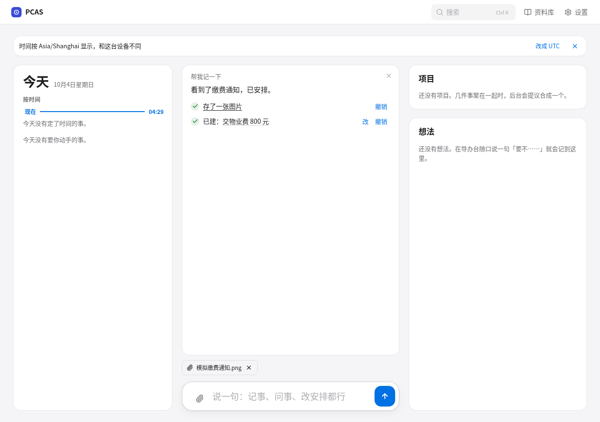
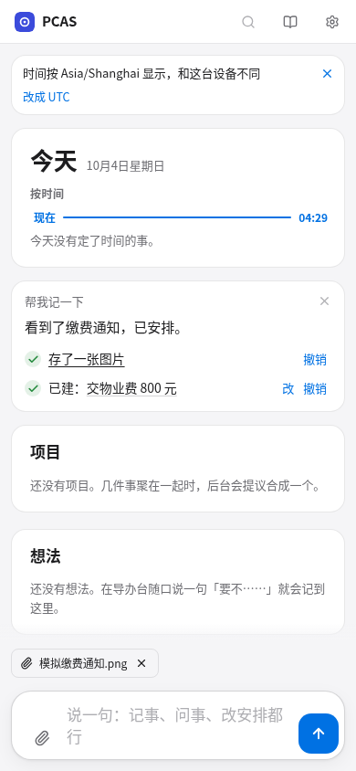

# M1 image validation

Synthetic fixtures only. No production database, model account, Telegram bot, screenshot or content was used. Product work is isolated on `improve/m1-images`.

## Coverage

Expectations were recorded before implementation in [M1 expectations](../tasks/improvements/M1-images-expectations.md).

| Sequence | Test |
| --- | --- |
| V1 | `TestM1V1ExistingUploadAndDeskHTTP`, `TestM1V1V2ImageSecretaryAndReplay` |
| V2 | `TestM1V1V2ImageSecretaryAndReplay` (empty caption), Playwright `image-only, PDF and audio share the stored attachment path` |
| V3 | `TestM1V3TelegramImageUsesSharedDeskTurn` (caption and image-only; delivery retry; cross-channel undo) |
| V4 | `TestM1V4V5FailuresRetainImageAndUseCaption/no-vision` |
| V5 | `TestM1V4V5FailuresRetainImageAndUseCaption/500` |
| V6 | `TestM1V6BackgroundImageUsesVisionOnce`, `TestM1ScannedPDFPagesPreferVision`, `TestM1V4V5FailuresRetainImageAndUseCaption/budget` |
| V7 | `TestM1V7ImageUndoPreservesTaskAndReplay`, `TestM1ExternallyDeletedImageExpiresUndoAndClearsContext` |
| V8 | `TestM1V8ImageTextCannotGroundUserMemory` |
| V9 | `web/tests/secretary-attachments.spec.ts`: selection/paste/drop/removal/send on both pages at 1280 and 390 pixels, invalid files, PDF/audio, failed upload retry |
| V10 | `TestVisionProtocolPayloads`, `TestVisionCodexRPC`, `TestVisionUsesAuthorizedResponsesImageInput`, `TestVisionSelectionAndUnsupported` |

Additional tests cover owner isolation, rebinding, concurrent identical requests and keeping existing OCR images unchanged. `TestM1RandomizedReverseUndoRestoresContents` creates eight image-only turns with randomized attachment counts and reverses every undoable receipt, restoring workspace contents and removing originals/derivatives without inventing user evidence. Existing action audit records remain as designed. Parser executables are deterministic local stubs; protocol calls use local HTTP servers or a fake Codex subprocess.

## Local validation

- Go vision protocol tests with race detection: passed for all five protocols.
- All new M1 PostgreSQL and Telegram tests with race detection: passed (`10.049s` and `2.012s`), including randomized reverse undo.
- Existing Telegram integration tests with a disposable PostgreSQL database: passed.
- `make fmt-check lint build`: passed.
- `make check`: failed at the unchanged legacy Telegram expectation described below. Its PostgreSQL invocation had no test DSN; database acceptance was run separately against a disposable database.
- Frontend `npm run lint`, `npm run type-check`, `npm run build`: passed.
- New attachment and existing settings/things mocked browser regression: 35 passed at desktop/mobile widths. One earlier combined run failed transiently in the existing H1 timeline test; isolated retry and the complete final run passed without changing that test.

The PR description records the full database regression and the final results of all five backend CI jobs. Temporary PostgreSQL uses a separate container, fake credentials, an ephemeral data directory and a loopback-only random port; it is removed after testing.

## Codex image support

Installed CLI: `codex-cli 0.160.0`. The [official app-server documentation](https://learn.chatgpt.com/docs/app-server#items) lists text, image and localImage input. Its generated `v2/TurnStartParams.json` contains `UserInput` with `type: image` and `url`, plus `localImage` with `path`. PCAS sends an inline data URL via `turn/start.input`, preserving disabled shell/file tools and ephemeral, read-only threads. `TestVisionCodexRPC` asserts the complete turn input. This does not claim a live account/model acceptance test; that belongs to the coordinator.

## Known existing expectation

`internal/telegram/poller_test.go:TestAttachmentsCaptionsAndLimits` still expects an attachment-only PDF to bypass DeskTurn, and its fake upload returns an empty source reference. M1 now forwards that file to the shared secretary entry point. The expected request count changes from one to two and the fake should return a valid source reference. This existing test was deliberately not edited, as instructed. Its failure is reported by `make check` and the CI `check` job, rather than hidden or skipped.

## Screenshots

Generated through fully mocked browser routes. Both screenshots show the image receipt, an independent task receipt and a removable pending attachment.

