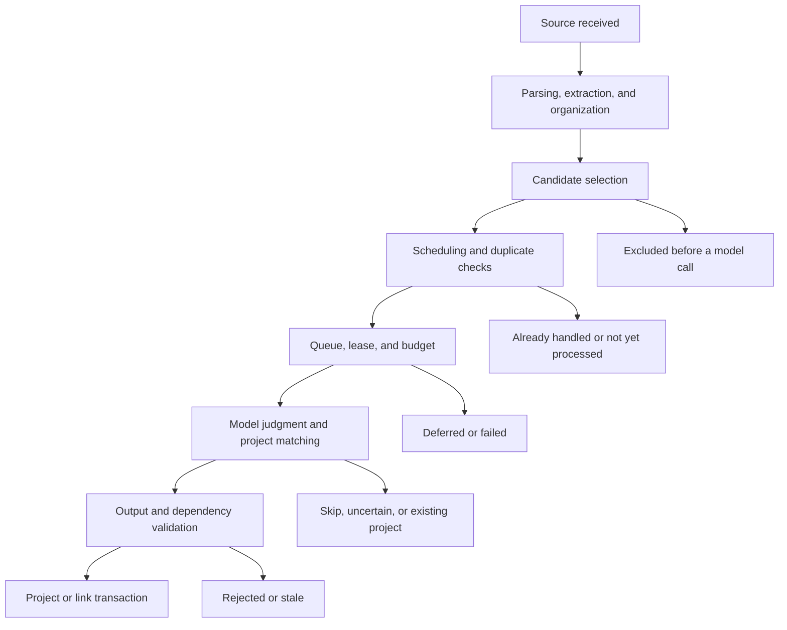

# Phase 3.9: Existing Paths and Baseline Evidence

Recorded 2026-10-08. Code revision: `4af34cd`.

This record covers the first foundation step: existing paths, dependencies, records, recovery, and measurement gaps.
It does not report a code migration, a new model check, or repaired product behavior.
The [System Architecture](../architecture.md) supplies the target boundaries.

## 1 Method and Limits

The audit used `go list -deps -export -json ./cmd/... ./internal/...` and Go type information.
Resolved call expressions identify provider calls without depending on the field name `s.models`.
The selected production files use the current Linux build configuration. Test files are excluded from that call inventory.
Provider transport, application calls, and evaluation calls have separate classifications.

Manual checks include worker handler method values and HTTP registrations in loops and helper functions.
Those registrations cannot be counted as ordinary direct calls.
SQL strings identify investigation points. Their text alone does not prove a complete transaction or table dependency.
The tables below include the related helper paths.

No application code, model input, output schema, or database data changed during this audit.
Live reads used a read-only transaction with a statement timeout.
Private records stay outside the repository. This report contains no source text, credentials, or owner identities.

## 2 Application Entry Points

| Entry | Existing path | Responsibility and dependency |
|---|---|---|
| Service startup | [Main](../../cmd/pcas/main.go) | Constructs storage, providers, channels, background loops, and HTTP services. |
| Memory input and retrieval | [HTTP server](../../internal/httpapi/server.go) | Calls the memory service and PostgreSQL implementation. |
| Workspace commands and secretary | [Workspace routes](../../internal/httpapi/workspace.go) | Calls commands, secretary turns, and legacy answer and routing paths. |
| Memory continuity and connectors | [Connector routes](../../internal/httpapi/connectors.go) | Configures input, imports records and archives, and changes import progress. |
| Archive upload | [Upload routes](../../internal/httpapi/archive_uploads.go) | Receives archive parts and passes complete input to import processing. |
| Current-state reads | [Library routes](../../internal/httpapi/library.go) | Reads background progress, dates, handovers, and memory groups. |
| Workspace files and documents | [Studio routes](../../internal/httpapi/studio.go) | Reads project plans and document history. Adds or removes workspace files. |
| Usage reads | [Usage routes](../../internal/httpapi/usage.go) | Reads recorded calls and execution timings. |
| Model configuration | [Model settings](../../internal/httpapi/model_settings.go) | Changes configuration, tests Jev routing, and schedules embedding backfill. |
| Account management | [Codex routes](../../internal/httpapi/workspace.go), [direct channel](../../internal/httpapi/chatgpt_direct.go) | Manages account state. Account queries are distinct from generation. |
| Notifications | [Notification routes](../../internal/httpapi/notify.go) | Configures channels, tests delivery, and dismisses notices. |
| Test cleanup | [Smoke routes](../../internal/httpapi/smoke.go) | Removes identified test associations through existing cleanup rules. |
| Telegram input | [Poller](../../internal/telegram/poller.go) | Handles text, images, voice, stored-turn replay, and secretary actions. |
| Polling and folder input | [Connector runner](../../internal/postgres/connector_runner.go) | Claims a connector lease, receives input, and stores cursor progress. |
| Queue processing | [Worker](../../internal/worker/worker.go), [handler map](../../cmd/pcas/main.go) | Dispatches source, memory, date, project, and current-state jobs. |
| Scheduling and backfill | [Main](../../cmd/pcas/main.go) | Starts status, organization, comparison, and extraction backfill loops. |
| Deputy and reminders | [Main](../../cmd/pcas/main.go) | Starts deputy runs, reminder creation, and notification delivery. |
| Account diagnostic CLI | [CLI](../../cmd/pcas/chatgpt.go) | `chatgpt-verify` calls direct-channel verification without a PCAS database. |
| Evaluation CLI | [Evaluation tool](../../cmd/pcas-eval/) | Uses separate datasets and accounting. Production startup does not dispatch it. |

Health, readiness, session, static-file, configuration, and account paths remain part of the entry-point audit.
They do not all invoke models or create business actions.

## 3 Business Paths, Writes, and Recovery

The record names below identify principal writes and recovery points. They are not complete lists of SQL dependencies.

| Path and code | Main records | Recovery or invariant to preserve |
|---|---|---|
| [Source reception](../../internal/postgres/sources.go) | Source and record versions, contexts, work queue. | Source identity, access, version checks, and source/job transaction. |
| [Archive import](../../internal/postgres/import_batches.go), [connectors](../../internal/postgres/connectors.go) | Import batches, archive entries, sources, connector progress. | Partial progress, duplicate identities, pause/resume, and deletion markers. |
| [Attachment processing](../../internal/postgres/attachments.go), [image reading](../../internal/postgres/vision.go) | Derived sources, attachment model results, usage, reservations. | Reuse saved page/image/transcript results before another paid call. |
| [Chunk and index processing](../../internal/postgres/jobs.go), [index writes](../../internal/postgres/processing.go) | Chunks, record search, jobs. | Source version checks and fenced acknowledgement. |
| [Embedding processing](../../internal/postgres/processing.go) | Embeddings, usage, reservations, jobs. | Skip committed vectors. Paid vector output has no durable result receipt before application. |
| [Extraction](../../internal/postgres/processing.go), [conversation extraction](../../internal/postgres/conversation_extract.go) | Claims, evidence, extraction state, automatic capture candidates, jobs. | Original source versions, saved model result, duplicate capture control, and fenced writes. |
| [Organization](../../internal/postgres/organize.go) | Claim classification, groups, dates, requirements, processing markers. | Evidence dependencies, rule versions, saved result, and atomic application. |
| [Statement comparison](../../internal/postgres/compare.go), [rejudgment](../../internal/postgres/compare_rejudge.go) | Comparison decisions, claim relationships, markers. | Current versions and saved-result recovery. |
| [Entity candidates](../../internal/postgres/entity_candidates.go), [comparison](../../internal/postgres/compare_entities.go) | Scan membership, alias candidates, decisions, entity relations. | Candidate progress, identity constraints, and fenced application. |
| [Retrieval](../../internal/postgres/retrieval.go), [memory use](../../internal/postgres/memory_use_heavy.go) | Optional query-embedding usage, reader usage, memory-use records. | Access, scoped ranking, version references, and explicit coverage gaps. |
| [Summary](../../internal/postgres/summaries.go) | Derived views, summary keys, dependencies. | Current-version and coverage checks. This path assembles excerpts without a generation call. |
| [Structured writes](../../internal/postgres/commit.go), [editing](../../internal/postgres/editing.go) | Claims, entities, episodes, evidence, versions, dependent state. | Transaction boundaries, correction, deletion, and source-access rules. |
| [Global handover](../../internal/postgres/status_handover.go), [project handover](../../internal/postgres/project_handover.go) | Handovers, dependencies, usage, saved results. | Membership hashes, input evidence, paid recovery, and fenced writes. |
| [Effort](../../internal/postgres/effort.go), [plans](../../internal/postgres/schedule.go) | Task effort, schedule rules, jobs, saved results. | Current dependencies, user estimates, and application transaction. |
| [Automatic projects](../../internal/postgres/topic_projects.go) | Project checks, links, workspace items, action log, entity links. | Evidence hashes, page progress, daily deferral, saved results, and undo. |
| [Date review](../../internal/postgres/date_tidy.go), [date completion](../../internal/postgres/deadline_completion.go) | Date checks, claim completion markers, actions, workspace state. | Version checks, atomic changes, receipts, and undo. |
| [Secretary turn](../../internal/postgres/desk_turn.go), [actions](../../internal/postgres/desk_actions.go) | Original sources, turn response, dependencies, usage, receipts, mutations. | Request ordering, cancellation, retry checks, saved response, and action atomicity. |
| [Deputy](../../internal/postgres/runs.go), [revision](../../internal/postgres/document_revise.go) | Agent runs, run dependencies, document versions, result receipts, usage. | Run leases, source versions, cached revisions, adoption, and undo. |
| [Workspace commands](../../internal/postgres/commands.go), [action log](../../internal/postgres/actions_log.go) | Workspace objects, command identities, action changes, revision state. | Duplicate commands, atomic operations, successor checks, and reverse undo. |
| [Reminders](../../internal/postgres/reminders.go), [delivery](../../internal/postgres/notify.go) | Notices, subscriptions, delivery state. | Delivery errors and reminder progress remain visible. No model call in these paths. |

Storage and business orchestration currently share `Store` and transaction helpers.
Extraction also creates workspace candidates. Memory interpretation must not acquire a dependency on concrete workspace orchestration during migration.
The deputy combines generation, saved-result recovery, revision, and self-check in one execution path.
Separating packages alone does not separate those responsibilities.

At this revision, resolved calls to `saveItem` occur in 13 production files; its definition file and tests are excluded.
The callers cover capture, commands, secretary actions, date review, effort, plan refresh, reminders, adoption, signals, deletion, and cleanup.
Direct SQL also changes `work_items` in commands and topic-project undo. Generic undo constructs some table names dynamically.
Counting `saveItem` callers alone therefore understates the complete write boundary.
The target workspace owner must receive these changes as explicit commands while storage retains SQL execution.

[Schedule queries](../../internal/postgres/schedule.go) read task times from `work_items` and extracted dates from `deadlines`.
They use a read-only transaction. Presentation is not a separate owner of either object.

## 4 Application Model Call Inventory

Each row identifies an existing call site or closely related alternatives.
These sites do not establish the number of live calls or their complete cost.

| Caller | Provider method | Budget, usage, and recovery findings |
|---|---|---|
| [Background generation](../../internal/postgres/background_model.go) | `Generate` | Reservation, usage, settlement, and durable paid result. Input snapshot recovery precedes business writes. |
| [Secretary generation](../../internal/postgres/desk_model_retry.go) | `GenerateWithSearchSchema` | Per-attempt reservation and settlement. Usage depends on caller metadata. Retry checks dependencies. |
| [Readers and self-check](../../internal/postgres/memory_use_model.go) | `GenerateSchema`, `Generate` | Separate reservation, asynchronous accounting, and usage. No general durable result receipt. |
| [Deputy generation](../../internal/postgres/runs.go) | `GenerateWithSearchSchema`, `GenerateWithSearch` | Run reservation and settlement. Revision has a saved-result path; ordinary output has a different recovery path. |
| [Legacy answer](../../internal/postgres/desk.go) | `GenerateWithSearch` | Independent answer and accounting workflow. The HTTP route remains registered. |
| [Background embedding](../../internal/postgres/processing.go) | `EmbedProviderUsage` | One job reservation, batched call records, and version-checked vector writes. |
| [Query embedding](../../internal/postgres/retrieval.go) | `EmbedProviderUsage` | Reservation and settlement. Usage lacks the enclosing turn/run/job association. |
| [Attachment transcription](../../internal/postgres/attachments.go) | `TranscribeUsage` | Duration-based cost estimate and saved transcript. Successful receipt accounting omits the measured call duration. |
| [Attachment vision](../../internal/postgres/vision.go) | `Vision` | Saved image result and OCR fallback. Successful receipt accounting omits the measured call duration. |
| [Telegram voice](../../internal/telegram/poller.go) | `Transcribe` | Bypasses application reservation and usage. Stored-turn replay can avoid transcription after a completed turn. |
| [Legacy routing](../../internal/httpapi/workspace.go) | `Router.Route` | Sends input through Jev. No common invocation, reservation, or usage record. |
| [Routing connection check](../../internal/httpapi/model_settings.go) | `Router.Route` | A real external call during key configuration. No common invocation record. |
| [Unused card generation](../../internal/postgres/status_build.go) | `Generate` | `statusGenerate` has no production caller. Keep it distinct from the registered `ProcessCard` queue compatibility handler. |

The [provider adapter](../../internal/ai/provider.go) supplies generation, embeddings, and provider accounting estimates.
Schema generation falls back to ordinary generation outside Codex. The supplied schema is not enforced in that fallback.
Transport-internal calls are not additional application entry points.
The account verification CLI also performs real generation through `siwc.Manager.Verify`.
Its diagnostic boundary and accounting need an explicit decision before gateway coverage can be accepted.

`generatePaid` is a useful reference for reservation, paid-result persistence, idempotent usage, and settlement.
Its job-specific result key does not cover all interactive and multi-stage calls.
Its failure paths and cancellation behavior still need scenario checks before reuse in the gateway.
The registered legacy answer route is callable, despite its absence from the current frontend.
Retiring it requires a supported-client check; it is not equivalent to unreachable card generation.

Production instruction declarations remain in PostgreSQL files, including shared fragments and unused card instructions.
Inline self-check instructions also occur in memory-use and deputy workflows.
Context-writing helpers contain instructions such as evidence-reading rules, in addition to serialized source data.
The prompt migration must inventory both forms and compare final requests.

## 5 Trace Creation and Non-Creation

The following findings use [automatic project code](../../internal/postgres/topic_projects.go) and [budget code](../../internal/postgres/background_budget.go).
These are current mechanisms, not newly accepted business requirements.

| Boundary | Current mechanism | Evidence gap |
|---|---|---|
| Input processing | Source, extraction, organization, and entity records establish project evidence. | No single execution link covers all processing stages for an expected project. |
| Candidate SQL | Requires current members and applicable goal/date conditions. Excludes already-linked entities. | A group excluded by the query has no candidate decision record. |
| Input eligibility | Checks member count, entity kind, goal/date evidence, and recent activity. | Different exclusion reasons return the same `pgx.ErrNoRows`. |
| Scheduler duplicate check | Existing links or a saved skip for the evidence can suppress new work. | The scheduling pass does not record a per-candidate suppression reason. |
| Queue insertion | Conflict handling can keep an existing job. | No general scan receipt proves which candidate range was examined. |
| Budget and scheduling | Stage capacity, daily budget, lease state, and daily project limits can delay work. | Job events contain some reasons. Links to candidate selection remain incomplete. |
| Model decision | Stores valid page decisions with their reason. Matches existing projects across pages. | Project checks have no decision timestamp. They do not cover candidates excluded before generation. |
| Uncertain or invalid output | Discards the paid result and returns a retry reason. | The discarded raw output cannot be reconstructed from the retained decision table. |
| Changed input | Discards stale results and acknowledges obsolete jobs. | A success event can mean obsolete work was acknowledged, without project creation. |
| Final application | Writes the project/link, action, entity association, and job completion. | No common execution identity joins the entire input-to-action path. |

An absent project does not prove an incorrect model judgment.
Investigation must distinguish source processing, exclusion, suppression, waiting, deferral, model decision, validation, and failed application.
An absent model call also does not prove that the relevant candidate was examined.

## 6 Existing-Record Baseline

A private snapshot records usage and timings for seven completed calendar days in each owner's stored time zone.
It also records current queue states, stage outcomes, retained project decisions, input counts, and schema checksums.
The read completed successfully. All recorded migration checksums match this repository revision.
The deployed application revision is unknown; matching schema does not prove matching application code.

| Measure | Available evidence | Limitation |
|---|---|---|
| Calls | `model_usage`, grouped by local day, purpose, provider, and model. | Unrecorded Telegram and routing calls are absent. Rows are not complete attempted-invocation history. |
| Context | Input token totals and versioned memory references. | Exact context size, prompt hash, source expansion, clipping, and historical request contents are incomplete. |
| Cost | Recorded cost and estimation flags. | Estimates are not invoices. `background_usage` mixes maximum reservations and settled amounts in one field. |
| Duration | Measured call duration and `execution_timings`. | Some successful media receipts lose duration. Execution timings cover secretary and deputy, not all background stages. |
| Progress | Queue states, next availability, attempts, and stage events. | Current state does not reproduce every previous scheduling pass or unselected candidate. |
| Quality | Existing rollout cases and retained project decisions. | Historical reports are not a new reproduction or a controlled migration comparison. |

The snapshot is an observation baseline. It is not a controlled replay baseline or proof of increasing cost.
It cannot supply missing prompt contents, unrecorded calls, or the reason for every excluded candidate.

| Investigation case | Existing evidence | Check before a later business repair |
|---|---|---|
| Incorrect automatic project | [Phase 3.6 report](2026-10-08-phase3_6-rollout.md) records a project that appeared to describe past travel. | Current source evidence, candidate rule, raw judgment, and actual project/link action. |
| No expected project | User acceptance now requires this investigation direction. No attributed reproduction is recorded here. | Follow a source through processing and every exclusion, waiting, and decision boundary. |
| Unexpected timeline entries | [Phase 3.6 report](2026-10-08-phase3_6-rollout.md) records old or tentative arrangements. | Statement time, extracted date, current applicability, and schedule projection. |
| Missing automatic task | [Phase 3.5 report](2026-10-08-phase3_5-rollout.md) says historical input was not re-extracted automatically. | Extraction rule/version, source completion, candidate state, and actual workspace write. |
| Reply differs from action | [Phase 3.6 report](2026-10-08-phase3_6-rollout.md) records a check-mode reply that claimed a skipped date change. | Raw reply, validated proposal, skipped receipt, and unchanged data. |

Before changing each production path, freeze its representative input and record the current configuration on an isolated copy.
Use the same model, input versions, concurrency, and operation sequences for the migration comparison.
Keep private prompts and raw outputs with the affected scenario.
Select call, cost, duration, and quality targets from that scenario's measurements.
Do not publish private source examples or treat historical manual edits as product output.

## 7 Verification Structure

| Check group | Existing evidence | Foundation concern |
|---|---|---|
| Unit and package checks | [Makefile](../../Makefile) | `make check` also runs all PostgreSQL package tests. It is not a unit-only command. |
| Database checks | [Integration helper](../../internal/postgres/integration_test.go) | Some tests skip without the database variable. Other fixture helpers start their own Docker database. |
| CI database checks | [Memory workflow](../../.github/workflows/memory.yml), [shard script](../../scripts/test-shard.sh) | CI separates packages and PostgreSQL slices. Historical schema fixtures need explicit classification. |
| Browser acceptance | [Real backend support](../../web/tests/support/README.md) | Uses real storage and operation sequences. Browser execution needs `env -u DISPLAY`. |
| Model acceptance | [Secretary check](../../internal/postgres/desk_codex_test.go), [evaluation tool](../../cmd/pcas-eval/) | Real default-channel results need isolated data and private input/output evidence. |

No test was added, removed, renamed, or run as part of this inventory.
Go type checking was used for static analysis; document links, indexing, and writing limits were checked separately.
First-step evidence now identifies the existing paths and their measurement gaps.
Controlled scenario baselines remain necessary before the corresponding path changes.
The next foundation work is the shared skeleton, followed by a complete pilot path.
