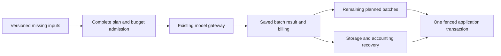

# Foundation Background Embedding Gateway

Execution scope for Sol under the approved Phase 3.9 architecture.
Status: path examination and contract preparation. Implementation and acceptance are incomplete.
The examined revision is `9f80205073078e766152856de79854a73555c8b6`.
That query embedding revision is not released.

Use the [architecture](../architecture.md), [workflow](process.md), and [executor rules](../../AGENTS.md).
This scope follows the [query embedding batch](foundation-query-embedding.md).
It does not change memory interpretation, project selection, or task rules.

## Goal

Send background embedding calls through the existing gateway.
Keep each returned batch before another batch or the final data transaction can fail.
Recover storage and accounting without repeating a known paid call.
Keep the original full-job budget admission and final atomic vector application.



## Verified Starting Path

These are code observations. They do not measure production failure frequency.

| Concern | Existing path and behavior |
|---|---|
| Entry | `ProcessEmbedding` in `internal/postgres/processing.go`. Existing worker handlers supply the job. |
| Source input | Read source chunks in ordinal order. Submit each original chunk body. |
| Other input | Read the original whole body from `memory_text` for the job record. |
| Existing vectors | Remove matching record versions already indexed for the selected provider and model. |
| Provider selection | Select one provider before processing the job. Keep that selection across its batches. |
| Admission | Reserve the complete missing-input estimate through `reserveModelCostID`. |
| Provider batching | Submit at most 32 texts in each provider call. Keep input order and original text bytes. |
| Usage | Write a separate `model_usage` identity for each batch. |
| Returned results | Keep every vector in process memory until the final transaction. No durable batch result exists. |
| Application | Check the job lease and current record version. Save all vectors and acknowledge the job in one transaction. |
| Failure retry | The current handler uses `cost == 0` for a provider failure. This does not establish a free model. |

The provider adapter validates response count, indexes, dimensions, and finite vector values.
It returns vectors in input order, with the original `float32` values.
It supplies token, cost, duration, and estimation fields where available.

### Storage-Failure Baseline

A synthetic source produces 34 chunks under the current split rule.
The unchanged handler makes two fake-provider calls before its final transaction.
A test trigger rejects vector writes after both calls return.
The transaction keeps zero partial vectors.

After the trigger is removed, the same leased job makes both provider calls again.
The observed totals are four calls and four usage records.
The retained contract fails because storage recovery repeats known paid batches.
This finding does not measure production incidence or actual provider spending.

The private contract source, failure log, and source hash remain available for migration acceptance.
The contract is not installed in ordinary CI before its production behavior is implemented.

### Controlled Production-Copy Baseline

The retained production snapshot has no ready embedding job.
Its source, claim, and episode embedding jobs are complete.
The initial selection failure remains recorded.

The controlled case receives an unchanged stored source body under a new copy-only external ID.
It uses normal ingestion, chunk processing, and source embedding handlers.
It does not reset completed jobs or claim an original wire-request capture.

The source produces 30 chunks. One real embedding call returns all vectors.
Its ordered input texts exactly match the original source's stored chunks.
Vector application, usage, and settlement checks pass. Claim counts remain unchanged.
Strict offline replay consumes that response without a live HTTP call or Codex process.
Both runs retain complete owner-data snapshots. Generated identities and runtime differences remain subject to comparison.

Existing architecture and prompt registry checks also pass at the examined revision.
This baseline covers the source path. Claim, episode, and model-backfill coverage remains required.

### Limits and Gaps

| Value | Basis | Reason and overflow |
|---|---|---|
| 32 texts per call | The current `ProcessEmbedding` loop. | A measured reason is unavailable. Remaining texts use subsequent batches. Keep the value in this migration. |
| Input estimate | Sum of `(len(text) + 16) * InputPerMillion / 1e6`. | Existing byte-based estimate. Its calibration is unknown. Keep it distinct from actual or estimated provider usage. |
| Unknown-outcome attempts | The architecture's existing five-attempt recovery chain. | Initial queue basis, not a measured optimum. Record every attempt; pause at exhaustion. |
| Daily budget | Existing workspace settings and `budget.go`. | Preserve full-plan admission. Budget exhaustion remains deferred or paused under the applicable recovery contract. |

No query prefix is added to background texts.
Do not change chunk splitting, queue priority, model backfill selection, or the provider response contract.
Do not infer free service from missing prices or a zero estimate.
An explicit synthetic free-provider fixture does not describe production prices.

## Storage and Accounting Constraints

The existing gateway already accepts an embedding operation, ordered texts, a pinned provider, and a reservation estimate.
Reuse `modelcall.Gateway.Call`. Do not add another provider entry or wrapper.

The background journal distinguishes stages within one execution.
Its current result adapter uses the execution ID as `background_model_results.job_id`.
That key cannot preserve several independent batch results for one job.

The query adapter already uses invocation IDs as private-result keys.
The result table has no foreign key that requires its key to identify a queue job.
Keep the real queue job as the execution identity. Do not invent child jobs for result storage.

Migration `062_model_calls.sql` permits only one invocation per reservation ID.
Therefore, several batch calls cannot directly share one linked reservation ID.
Do not remove this constraint or multiply the complete job estimate for each batch.

### Complete Admission and Batch Reservations

Prepare the complete missing-input plan before the first provider submission.
Record ordered references, input hashes, provider and model, batch boundaries, and the original total estimate.
Keep necessary private text only in the existing private-result storage.
The journal and receipts contain identities and hashes, not source bodies or vector values.

The implementation must preserve this accounting invariant:

`admitted unsubmitted estimate + active invocation holds + settled spending = current job budget protection`.

Use the existing budget rows for a remaining admission hold and individual invocation reservations.
Transfer each planned batch estimate from the remaining hold to its invocation within one transaction.
The transfer must not increase the admitted total or pass the daily-budget check a second time.
Link the invocation, reservation, and plan in that transaction.
Document rounding under the existing `numeric(14,6)` storage before implementation.
The final allocation must retain the stored remainder. Do not discard it through floating-point subtraction.

Release only the unused admission hold when the plan completes or becomes inapplicable.
Keep unknown invocation holds and known spending after deletion, failure, or lease loss.
A replacement for an unknown invocation needs additional budget under the existing bounded recovery contract.
It cannot use the hold for a different unsubmitted batch.

If these invariants need a schema change, stop under `AGENTS.md` section 9 and present the migration first.
The current scope does not approve a migration or another budget policy.

### Plan and Result Identity

Give each planned batch a stable stage identity within the real job execution.
Bind it to the original record version, selected provider and model, ordered inputs, and processing-rule version.
Lease changes must not renumber batches or reset recovery counters.
Do not rebuild batch boundaries from a shorter missing-input list after partial progress.

Save each response under its original invocation ID before requesting the next batch.
Validate the result's owner, execution, input, reservation, provider, model, and hashes before reuse.
Reuse known results before checking credentials for a new provider submission.
Keep original vector values and ordering during serialization and reload.

Keep complete application atomic.
After all batches are available, validate the original lease and current record version in the final transaction.
Write vectors and acknowledge the original job together.
Keep earlier accepted vectors when a later plan cannot complete.
Record executed, skipped, or failed application with its reason and original invocation links.

### Deletion and Recovery

The input manifest must include the actual source or claim and each submitted chunk reference.
The source owner must remove the private plan and affected private batch results in its deletion transaction.
The existing interactive scrub only selects `interactive-input-v1`; it does not cover this future background manifest.
Extend the applicable owner cleanup explicitly. Do not assume that queue deletion removes private result bodies.

Before submission, check the actual lease and active input versions under the existing lock order.
After deletion, a late response cannot restore private inputs, vectors, or an application result.
Preserve its non-text billing receipt for settlement.
Source edits and expired leases make old index application inapplicable. Record the reason.

Use the existing worker for durable accounting and interrupted-call recovery.
Retain pending returned results in process when persistence fails.
An unsaved response after process loss can remain unknown. Do not assert exactly-once provider execution.
Record each unknown replacement and retained hold. Pause visibly when the recovery allowance is exhausted.

## Evidence and Acceptance

Prepare the unchanged-path baseline before modifying production processing.
Use an isolated production-data copy for real background-job recording and strict offline replay.
Use the existing HTTP recorder and `production-replay` runner for supported source embedding jobs.
Claims and model-backfill stages need explicit runner coverage before their replay is claimed.
Do not infer that `source.embed` replay proves all embedding entries.

| Layer | Required evidence for this batch |
|---|---|
| Architecture | Run existing boundary checks first. Remove the `ProcessEmbedding` provider exception only after its complete path enters the gateway. |
| Owner contracts | Exact inputs, original full admission, per-batch billing, duplicate suppression, saved-result reuse, and explicit application outcomes. Use fake providers. |
| Recorded replay | Exact provider input and output, no live provider calls, complete owner-data snapshots, and an examined difference for every changed field. |
| Concurrency and timing | Storage failure after paid batches; later batch failure; duplicate jobs; lease reclaim; source edit or deletion during submission; late returns. |
| Real models | Verify the selected real embedding provider on isolated data, then the secretary through actual default Codex. Retain private raw evidence. |

Keep the old schema-upgrade and provider-accounting failures visible.
Do not edit expected values to hide changed admission, spending, or retry behavior.
Move the affected phase-coded embedding tests into behavior-named files during their actual migration.
Keep unrelated legacy tests outside this batch.

This batch does not complete the five test layers for all of Phase 3.9.
Nightly recall and doing score trends remain required after complete gateway coverage.

## Delivery

Use Sol's isolated worktree. Do not switch or stage `/root/PCAS`.
Stage only this batch's assigned files and examine the complete staged diff.
Run the required checks and retain each failed or omitted check with its reason.
Obtain acceptance from a different reviewer for state changes.
After integration and passing CI, follow the existing authorized backup, release, and live-check workflow.

## Sol Window Prompt

```text
You are Sol, the executor for the background embedding gateway batch.
Reply in Chinese. Write code, commits, and current documentation in English.
Read AGENTS.md, the current architecture, workflow, and this complete scope.
Use /root/PCAS-worktrees/foundation-deputy-main. Do not change /root/PCAS.
Recheck the branch and source revision before implementation.
First record the unchanged path and reproduce paid-batch loss with a fake provider.
Then capture a supported real job on an isolated data copy and verify strict offline replay.
Reuse Gateway.Call, existing budget rows, private result storage, and the worker.
Preserve complete admission, original inputs, batch order, and atomic application.
Give actual batches stable identities and save each response before the next submission.
Recover storage and accounting without repeating known paid calls.
Verify deletion, late billing, version checks, and bounded unknown recovery together.
Do not introduce a schema change or new retry policy without the required decision.
Keep every observed regression and baseline defect visible.
Run appropriate contracts, replay, real-model acceptance, and required checks.
Remove the direct-provider exception only after complete migration.
Do not claim release or Phase 3.9 completion without its required evidence.
```
