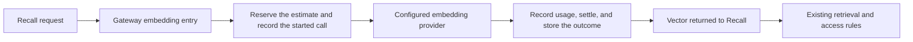

# Foundation Query Embedding Gateway

Revised by the coordinator on 2026-10-10. This page replaces the earlier scope and its candidate `9f80205`.
The earlier candidate was not merged into main or released. Its code is not on this branch.

This page covers the query embedding that `Recall` requests. Background indexing is a separate path.
It follows the architecture's [model gateway](../architecture.md#5-model-gateway).

## Why the Earlier Candidate Was Replaced

The earlier candidate treated one query embedding as a recoverable paid result.
It saved the query text and the vector, and it added a read-session lock to protect them.
The saved query text then needed its own deletion path when a source was deleted.

A query embedding costs the query length multiplied by the input price.
A caller that loses the vector can request it again.
The recovery machinery cost more to maintain than the calls that it protected.
This revision keeps the trace and the accounting. It removes the saved input and the saved result.

## Behavior

`Recall` keeps its query normalization, provider prefix, estimate, and retrieval rules.
The gateway entry `CallEmbedding` is the only caller of the embedding provider for queries.

| Step | Record |
|---|---|
| Before the provider call | One transaction reserves the estimate and inserts a `model_calls` row with outcome `started`. |
| After a returned call | One transaction records usage, settles the reservation to the reported cost, and sets outcome `returned`. |
| After a rejected call | The same transaction sets outcome `failed`. Reported or estimated usage is recorded as before this change. |
| After a canceled or interrupted call | The outcome is `unknown`. The reservation stays held. No usage row asserts a cost. |

The second transaction does not use the caller's context. A canceled read still records its call.
If the second transaction fails, `Recall` returns the error and does not use the vector.

The journal row holds the provider, the model, the input count, and the input byte count.
It does not hold the query text, a hash of the query text, or the vector.
Source deletion therefore needs no query cleanup.

Each query embedding has its own execution identity.
A query inside a secretary or deputy execution records that execution as its cause and keeps its root.
A standalone read is its own root.

## Fallback

`Recall` continues with text and attribute search when the vector is not available.
The response reports the gap in `coverage.gaps`. This is the existing visible state.
An unconfigured, unsupported, or unavailable provider starts no call, reserves no budget, and records no journal row.
A daily budget that cannot cover the estimate has the same result.

## Interrupted Process

A process can stop between the two transactions. Its row stays `started`.
The existing worker recovery pass sets such a row to `unknown` and `held` after ten minutes.
The longest provider request lasts three minutes, so a row of that age cannot belong to a live call.
The held reservation counts against the daily budget of its day only.

## Checks

| Check | Result |
|---|---|
| Gateway contracts in `internal/modelcall/embedding_contract_test.go` | Pass. |
| Storage contracts in `internal/postgres/query_embedding_contract_test.go` | Pass on an isolated PostgreSQL database. |
| Provider boundary test | Pass. The `Recall` exception is removed. The gateway entry is the declared caller. |

The release record gives CI, backup, and live results when this revision is released.

## Not In This Scope

- Background embedding in `ProcessEmbedding` still calls the provider directly. It keeps its migration exception.
- This revision does not change retrieval ranking, access rules, or the provider request body.
- This revision adds no table and no database migration.
