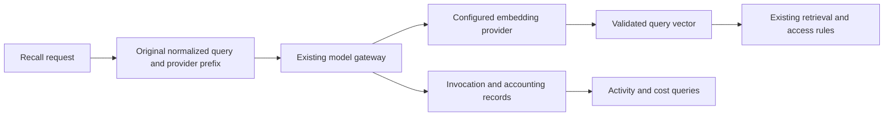

# Foundation Query Embedding Gateway

Executor: Sol. Scope prepared 2026-10-09 from `6411b4e`.

This scope continues the architecture's [model gateway](../architecture.md#5-model-gateway) and [recovery rules](../architecture.md#8-state-and-recovery-boundaries).
It covers query embeddings within the complete recall path. Background indexing is a separate path.
Keep package locations, retrieval rules, existing provider inputs, and permitted lexical fallback.

## Verified Starting Paths

| Responsibility | Current code | Required result |
|---|---|---|
| Query preparation and retrieval | `retrieval.go`, `Recall` | Keep normalization, provider prefix, structured search, lexical search, vector search, access, and ranking. |
| Provider call | `Recall` calls `EmbedProviderUsage` directly. | Submit through the existing gateway's `Call` entry. Remove this migration exception after acceptance. |
| Provider transport | `ai/provider.go`, `EmbedProviderUsage` | Keep the HTTP body, input ordering, vector validation, dimensions, and model identity. |
| Reservation and usage | `reserveModelCostID`, `recordUsage`, `settleModelCost` | Keep applicable pricing and reservation behavior. Recover accounting without another provider call. |
| Enclosing execution | `interactiveExecutionKey` in secretary and deputy context. | Link the query call to the actual enclosing execution when available. |
| Command preparation | `workspace.go`, `Execute`, calls `prepareRunContext` before creating a deputy run. | Record the command origin when available. Do not claim that a future run lease already exists. |
| Standalone recall | HTTP recall and direct recall consumers. | Give each actual read an execution identity. Do not fabricate a secretary ticket or worker job. |
| Optional semantic coverage | `Recall` returns coverage gaps when embeddings are unavailable. | Keep lexical fallback visible. Record the failed or unavailable semantic mode separately. |



## Scope and Order

1. Verify recall consumers, current execution identities, provider inputs, pricing, storage, and cleanup paths.
2. Establish the unchanged recall baseline on an isolated production-data copy.
3. Add an embedding operation to the existing gateway and its provider contract.
4. Add the necessary read-execution support to the existing journal and accounting adapters.
5. Migrate query embedding, result recovery, and visible fallback together.
6. Replay before and after migration with strict transport-input checks and complete owner snapshots.
7. Run actual default-channel acceptance, required checks, and complete CI.
8. Integrate directly, back up, release, and check the live default Codex secretary.

Do not move business packages or add a model wrapper, queue, table, or database migration.
Do not migrate background indexing, vision, audio, or legacy HTTP interfaces in this scope.
Do not alter retrieval meaning or repair project, timeline, or task symptoms.

## Embedding Call Contract

Keep one application gateway entry. Embeddings use an explicit operation with their original ordered input and selected provider snapshot.
Text-generation requests retain their current defaults and exact instruction and schema behavior.
Embedding requests do not have fabricated prompt names, instruction hashes, or output schemas.
Record the embedding capability, actual vector mode, input hash, provider, model, duration, usage, reservation, and outcome.

The provider adapter keeps its current validation of vector count, order, dimensions, and finite values.
Keep its model prefix and float representation. Saving a result must not change the vector later used by retrieval.
Save known output before retryable accounting writes. Retry persistence and accounting without another provider call.
Keep unknown outcomes, partial usage, and held reservations distinct from complete spending.
The original query path has no automatic provider retry. This scope does not add one.

The original estimate uses query bytes, sixteen framing bytes, and the configured input price.
The framing value comes from the existing code. Its measured basis is not established.
The estimate omits the provider query prefix; retain and report that existing gap instead of silently changing the budget policy.
Actual or estimated returned usage keeps its existing pricing basis and estimation labels.
No missing price or usage establishes a free call.

## Execution and Recovery

Nested query calls inherit the real secretary or deputy execution and its existing fence.
Keep the query stage distinct from generation, readers, and review. Do not charge the deputy's admission reservation for query embedding.
Bind a saved vector to the original owner, caller scope, query input, provider, and execution.
Do not reuse a result for a different request merely because its query text matches.
Preserve existing caller scope and access checks. Query embedding must not add a team-membership requirement for owner or granted-principal recall.
Command preparation can run before a deputy identity exists. Record that stage's actual origin and any missing enclosing execution.

A standalone query needs its own actual read identity and process-liveness evidence.
Use the existing PostgreSQL session-lock mechanism. Do not keep a transaction open across a provider call.
A dropped session must make interruption observable to recovery through the existing worker.
Queries do not acquire a fictitious business lease or authorize business writes.

Preserve a connection for journal and accounting writes.
The current store has ten pool connections and already uses a one-connection margin for foreground capacity.
Use that verified pool capacity as the initial basis. Waiting work follows the caller's existing cancellation path and starts no provider call.
Record waiting and interruption counts where the observation contract requires them. Do not add a private queue.
Account for connections already held by secretary admission and other current consumers.
Do not reacquire a foreground capacity slot from a secretary request that already holds one.
An independent read limit cannot reserve the last connection while another execution needs journal or accounting writes.
Check mixed secretary, standalone recall, and recovery work before selecting the final admission mechanism.

The shared recovery path must preserve known billing after caller cancellation or private-result removal.
Source deletion, lost access, and cleanup must not restore inaccessible upstream text.
Private query input and vector retention follow the existing execution and owner cleanup rules.
Where an input has no source identity, record its actual caller origin. Do not invent source references.

## Checks and Acceptance

- Preserve exact provider inputs and existing vector values during recorded replay.
- Keep the original request, caller scope, enclosing execution, reservation, usage, and returned mode linked.
- Use fake providers to check unsupported capabilities, unknown outcomes, cancellation, duplicate calls, write failure, and accounting recovery.
- Check standalone interruption, session release, connection capacity, and process restart without another paid call for a known result.
- Check parent execution expiry, source deletion, access changes, and own-request cleanup.
- Preserve existing model-switch, missing-key, retrieval ordering, visibility, and dimension contracts.
- Examine complete owner-data differences without excluding fields or rewriting failed evidence.
- Use the configured default embedding provider for embedding acceptance and the real default Codex secretary for complete-path acceptance.
- Run formatting, repository checks, pgvector integration checks, complete CI, backup, and live checks.

Remove only the migrated query provider-call exception.
Historical missing metadata stays missing. Filtered checks and synthetic fixtures do not certify real-model quality.
This scope does not complete Phase 3.9 or the background embedding path.

## Status

The unchanged complete secretary path passes recorded replay at `6411b4e`.
The original ordered model inputs match the recorded case. Replay completes two Codex calls and one embedding HTTP request.
Replay starts no live provider. The complete starting owner data matches the original row multiset.
Implementation, migration acceptance, complete CI, integration, and release remain outstanding.
The admission mechanism still needs a mixed-load check against existing connection consumers.
Baseline work must preserve non-root disk space for production recovery and retain complete comparison evidence.

### Baseline Evidence

The baseline uses the original production-copy data, recorded request, provider replies, and fixed business time.
It starts no service or continuous worker loop. The changed production query path has not been implemented.

| Check | Observed result |
|---|---|
| Original provider inputs | Strict Codex and HTTP replay pass. No provider call falls back to live execution. |
| Query usage | One additional query-embedding usage row is recorded. Claim counts remain unchanged. |
| Starting owner data | All 1006988 original rows match, including duplicate counts and complete fields. |
| Raw snapshots | Complete before and after snapshots pass byte, row, and hash checks. Both are retained in reconstructable archives. |
| Ordering | Restore changes row order. The first checker incorrectly required an identical whole-file hash; its failure remains recorded. |
| Corrected comparison | The snapshot implementation permits row-multiset comparison. The complete starting multiset matches without field exclusions or normalization. |
| After state | All raw changes remain retained. This baseline does not certify complete after-state equivalence. |
| Test environment | The first fixture preparation failed its loopback-port check before any replay. Its failure remains recorded. |
| Cleanup | The owned disposable database and temporary memory files are retired after evidence verification. Original backups and source data remain available. |

Private manifests, model replies, input cassettes, snapshots, and initial check failures remain outside Git.

## Sol Window Prompt

```text
Window: Sol
Continue Phase 3.9 under docs/tasks/foundation-query-embedding.md.
Read AGENTS.md, this scope, and its current specification links first.
Use your isolated worktree. Do not switch or stage /root/PCAS.
Use Chinese for user replies and English for code, commits, and current documents.
Verify the current recall, embedding, accounting, execution, and cleanup paths.
Establish a strict unchanged baseline on a verified production-data copy before migration.
Extend the existing gateway Call entry for query embeddings. Do not add a wrapper.
Keep provider input, vector order, dimensions, model identity, retrieval, and access behavior.
Use actual execution identities and visible capability and fallback outcomes.
Standalone reads need session-liveness evidence without an open model-call transaction.
Preserve the pool's connection margin and the original query retry and budget policies.
Do not invent prompt hashes, source references, business leases, or complete spending.
Save known output and recover storage and accounting without another provider call.
Test parent and standalone cancellation, deletion, access changes, restart, and connection contention.
Replay all owner data without excluding fields. Preserve failed evidence privately.
Run required checks and complete CI. Report all filtered, missing, and failed checks.
Integrate directly after clean review and passing CI. Do not create a PR.
Back up before release and test the live actual default Codex secretary afterward.
Clean only your smoke, request, or source identities and check claim counts.
Do not move packages, add a migration, or change unrelated model paths or business rules.
Ask only when an actual stop condition in AGENTS.md applies.
```
