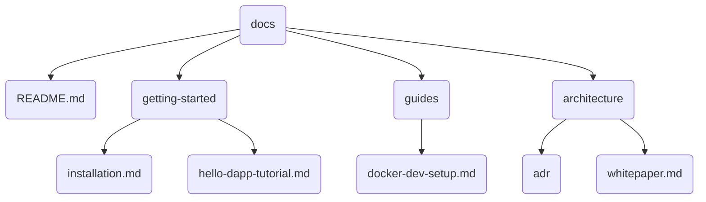

# v0.1.2 文档重构行动计划 (最终版)

## 1. 核心策略

- **单一语言源 (Single Source of Truth)**: 所有官方文档仅使用英文进行维护，以确保信息的一致性、准确性和最低维护成本。
- **用户翻译引导**: 在文档主入口 `docs/README.md` 添加明确提示，建议非英语用户使用浏览器或第三方工具进行页面翻译。
- **手动迁移**: 放弃自动化脚本，采用手动方式进行文件重构，以确保过程的精确控制。
- **统一规范**: 所有文件名和目录名统一使用 `kebab-case` 风格。

## 2. 最终目录结构

## 3. 执行步骤

1.  **创建目录**: 在 `docs/` 目录下创建 `getting-started/`, `guides/`, `architecture/`。
2.  **迁移并重命名**: 手动将所有现存的英文文档移动到对应的新目录中，并统一命名为 `kebab-case` 风格。
3.  **创建主入口**: 创建 `docs/README.md` 文件，它将作为所有文档的导航中心。
4.  **添加翻译提示**: 在 `docs/README.md` 的顶部，加入以下提示：
    > **Note for International Users:** This documentation is maintained in English. For other languages, we recommend using your browser's built-in translation feature or a dedicated translation service.
5.  **清理旧文件**:
    - 删除 `README.zh.md` 文件，贯彻单一信息源的原则。
    - 删除其他已被迁移的旧文档。
6.  **(可选但建议)** 为每个文档添加 `frontmatter` 元数据，以备未来的工具化处理。
