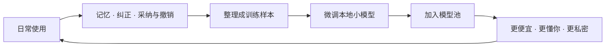
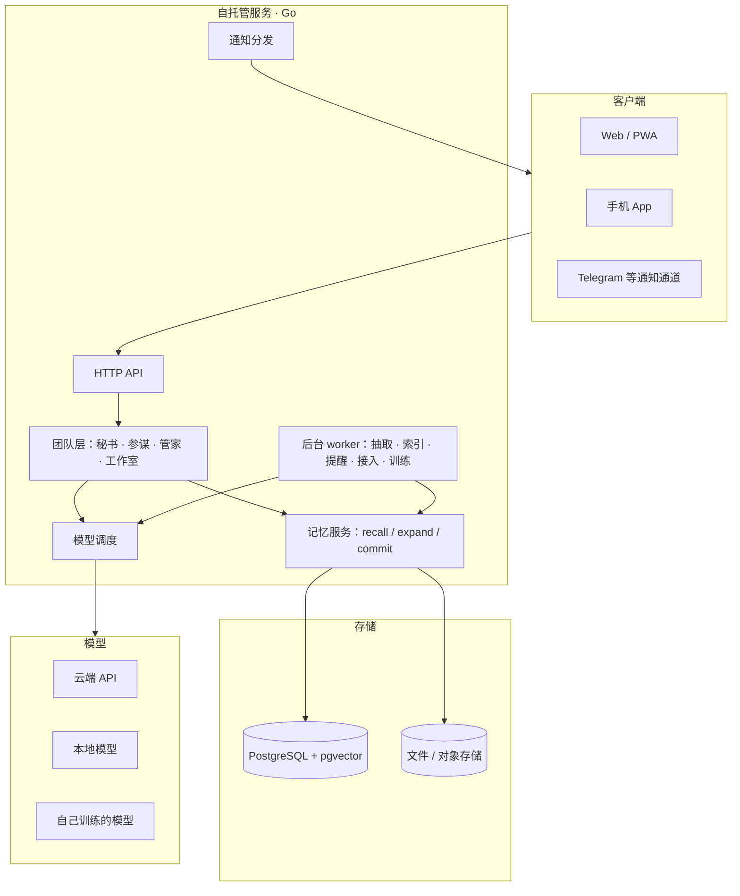

# PCAS 白皮书

Personal Central AI System · 2.0 草案 · 2026 年 9 月 30 日

> 本文是 PCAS 的上位文档。[产品需求](prd.md)、[界面与交互原则](design/principles.md)、[记忆架构](memory-architecture.md) 与后续开发批次以本文为准；冲突时先改本文，再改下游文档。英文版随中文定稿后提供。

---

## 0 摘要

PCAS 是一支**围绕你一个人、全天候工作的支持团队**：前台秘书接住你说的每一句话，二把手替你拆解和排期，管家照看日常，每件大事有自己的工作室，观测台让你看清团队里每个成员在做什么。整个团队共用同一个**记忆核心**：你说过的话、做过的事、接入的每一份资料，都能被按时间、地点、人物和事情找回来。

PCAS 开源、自托管、非商业。数据留在你自己的机器上。

和 ChatGPT 这类 AI 聊天产品的区别：

| | AI 聊天 | PCAS |
|---|---|---|
| 做什么 | 回一段话 | 把事办了，并告诉你办了什么 |
| 记忆 | 以会话为单位，换个窗口就忘 | 连续、结构化、可追溯，越用越懂你 |
| 呈现 | 长文，"1. 2. 3." | 能可视化就可视化：卡片、时间轴、日程块 |
| 主动性 | 你问它才答 | 到点提醒、条件满足时唤醒、看出苗头主动提议 |
| 数据 | 在别人的服务器上 | 在你自己的机器上，可看、可改、可删、可导出、可用来训练自己的模型 |

---

## 1 问题

1. **事情被聊天滚走。** 线性对话里冒出的想法和待办，几页之后就找不到了；换一个会话或换一个 AI，又得从头交代背景。
2. **数据散在各处。** 录音转录、邮件、各家 AI 的对话、IM、日历、账单，各在各的应用里，没有一处把它们连起来。
3. **AI 只会说，不会做。** 回答得再好，建日程、设提醒、找资料、起草邮件还得自己动手。
4. **两个极端。** 要么是黑盒，不知道它做了什么；要么是为了防它乱做，把每个决定都做成按钮推回给用户，结果用起来比自己做还累。PCAS 上一版就落进了后一个坑。
5. **数据越多越贵。** 什么都塞进上下文让模型自己找，数据量一上来，成本和延迟都会爆炸。

---

## 2 定位：一支支持团队

比喻：**秘书 + 公司二把手 + 管家**，再加上给每件大事准备的**工作室**，以及一个管理整个团队的**观测台**。它比你妈还了解你，是你的后盾：任何事、任何麻烦，只需要说一句，能干的马上就去干。

```
┌──────────────────── 观测台 / 管理面板（"HR"）────────────────────┐
│    谁在做什么 · 花了多少 · 用了哪些记忆 · 权限 · 失败与恢复 · 数据集   │
└─────────────────────────────────────────────────────────────────┘
   前台秘书        二把手 / 参谋       管家            工作室（Lab）× N
   一句话入口      拆解 · 估工作量     习惯 · 推荐      每件大事一个空间：
   回答 + 执行     倒推开工 · 排优先    预算 · 订阅      文件 + 专属记忆 + 副手
   卡片回执        发现冲突            收支 · 生活      可自动创建和备料
         └───────────────┬───────────────┘
            模型调度：大 / 小 · 本地 / 云端 · 有审查 / 无审查 · 自己训练的模型
┌──────────────────────────── 记忆核心 ────────────────────────────┐
│  上下文层（原文 · 转录 · 截图）  结构化层（人 · 地 · 时 · 事 · 习惯）  向量层  │
│          工作室记忆 = 同一套记忆里的一个范围，不是另一套系统             │
└─────────────────────────────────────────────────────────────────┘
   接入：Yufolo 转录 · 邮件 · AI 对话 · IM · 日历 · 文件 · 账单 · 屏幕 · 手机 GPS / 麦克风
```

**它不是什么：**

- 不是聊天机器人。对话只是入口，产出的是被安排好的事。
- 不是应用搭建平台。PCAS 为一个人服务，不做通用工作流编排。
- 不是商业服务。没有账号体系、没有云端托管、没有数据变现。

---

## 3 产品原则

| 原则 | 含义 | 反例（不这样做） |
|---|---|---|
| **一句话办事** | 用户说一句，系统理解整句意图，能做的都做掉：回答、建事项、设提醒、归项目、派副手，可以同时发生 | 先让用户选"问一下 / 记下来 / 交给副手" |
| **先做后报，一键撤销** | 可以撤回的动作直接执行，回执说清做了什么，附【改】【撤销】 | 先生成候选，等用户逐条确认 |
| **按钮只剩三种** | ① 完成打勾 ② 撤销 / 改 ③ 往外发送、删除、花钱之前的确认。其余的靠说或者系统自己判断 | 状态、截止、项目、副手、记忆全做成下拉框和勾选框 |
| **能可视化就不写长文** | 日程用时间块，进展用时间轴，花费用图，找到的记忆用带来源的卡片 | "今天 1. … 2. … 3. …" |
| **主动但会学** | 到点提醒、条件满足时唤醒、看出苗头就提议；被拒绝会记住，同类提议随之减少 | 固定频率唠叨 |
| **全程可观测** | 每个动作、每次模型调用、每条被用到的记忆，都能在观测台找到 | 黑盒 |
| **数据归用户** | 自托管；可看、可改、可删、可导出；删除会传播到检索、摘要和训练集 | 删了界面上的，底下还留着 |

系统内部概念（候选、推测、曝光度、证据类型、训练样本）不出现在日常界面，只在观测台里出现。

---

## 4 团队角色

每个角色 = 一组职责 + 能用的动作 + 默认模型策略 + 对应界面。所有角色共用记忆核心，也共用同一套动作和撤销机制。

| 角色 | 职责 | 能做的动作（举例） | 默认模型 | 界面 |
|---|---|---|---|---|
| **前台秘书** | 接住每一句话；回答、执行、转派 | 建 / 改 / 完成事项，设提醒，归项目，记住一件事，查记忆，联网查，派给副手或工作室 | 快速的中等模型；高频简单意图交给自己训练的小模型 | 首页对话、每个工作室底部的输入框 |
| **二把手 / 参谋** | 把大事变成可执行的计划 | 拆步骤，估工作量，从截止时间倒推开工时间，排优先级，发现日程冲突，提醒"该开始了" | 推理能力强的大模型，按需调用 | 工作室里的计划时间轴、首页"今天"里的建议块 |
| **管家** | 照看日常生活 | 学习习惯，推荐（音乐、晚餐、活动），跟踪预算、订阅和收支，提醒续费和异常支出 | 本地小模型做统计和判断，大模型只在生成推荐文案时调用 | 首页轻提示、观测台的生活面板 |
| **工作室（Lab）** | 为一件大事提供专门的空间 | 管理文件（云盘式），保存专属记忆，维护现状（结论 / 卡点 / 下一步），调度副手干活，文档出新版本并展示差异 | 按任务选择 | 工作室页 |
| **对外联络** | 代你和外界打交道 | 起草邮件和消息；**你点一下才发出** | 中等模型 | 待发列表、首页回执 |
| **观测台（"HR"）** | 管理整个团队 | 展示活动流、花费、模型调用、记忆使用、权限、失败与恢复、训练数据集 | 不调用模型 | 观测台 |

**工作室举例：** 系统从学校邮件里发现一份新作业，7 天后截止。它自动建立工作室，放入作业要求和相关课件，从过往记忆中找到你写同类作业的平均用时，并在日程里建议："周三晚上开始，分两次做完。"你打开工作室时，这些都已经准备好了。

---

## 5 记忆核心

记忆核心是 PCAS 的地基，也是这个项目的重点。完整规格见 [记忆架构](memory-architecture.md)，这里只讲定位和新增的部分。

### 5.1 三层结构，一套身份

```
                  ┌───────────────── 结构化层（重点）─────────────────┐
  问题 ──理解──▶  │ 实体（人/地点/组织/物品） 经历 陈述 习惯/规律 证据 关系 │ ──精确定位──┐
                  └──────────────────────────────────────────────────┘             │
                  ┌───────────── 向量层 ─────────────┐                               ▼
                  │ 原文片段 · 经历摘要 · 陈述文本    │ ──语义补漏──▶ 合并 · 核对原文与当前状态 ──▶ 少量、带来源的上下文
                  └──────────────────────────────────┘                               ▲
                  ┌───────────── 上下文层 ───────────┐                               │
                  │ 消息 · 文件版本 · 转录 · 截图 · OCR │ ──────────── 原文核对 ─────────┘
                  └──────────────────────────────────┘
```

- **上下文层**保存原件和当时的情境：消息、文件版本、转录、截图，以及前后相邻的对话。
- **结构化层**维护系统对"现在是什么情况"的理解：谁、在哪、什么时候、说了什么、打算什么、后来怎么变了。允许存在未知、候选和分歧。
- **向量层**负责措辞不同但意思相近的召回。所有向量都指回原始 ID 和版本，可以随时重建。
- **工作室记忆**是同一套记忆按工作室划出的一个范围，不另起一套系统。

### 5.2 查询规划：先想清楚找什么，再去找

一个问题先被翻译成结构化条件，用条件精确定位；向量只负责补漏；最后核对原文和当前状态。

**例："我去年说去成都要干什么来着？"**

| 步骤 | 做什么 | 结果 |
|---|---|---|
| ① 理解 | 时间 = 去年（按表达时间，2025-01-01 至 2025-12-31）；地点 = 实体「成都」（含别名）；性质 = 意向 / 计划；主体 = 我 | 结构化查询条件 |
| ② 结构化定位 | 在陈述中查：主体为我，性质为意向或计划，关联实体为成都，表达时间落在去年 | 命中 3 条 |
| ③ 语义补漏 | 在同一时间范围、同一经历里做向量检索，找回没直接写"成都"两个字的内容，比如同一次讨论里的"春熙路那家火锅" | 补回 2 条 |
| ④ 核对 | 检查后来有没有更正、是否已经去过、是否已经不打算去 | 1 条已完成，4 条仍有效 |
| ⑤ 呈现 | 回一张时间轴卡片：哪天说的、想做什么、现在的状态，每条都能展开看原话 | 不写长文 |

交给模型的上下文只有这 5 条，而不是 50 段"可能相关"的片段。**结构化层越扎实，每次调用越便宜、越准。**

### 5.3 成本原理

| 做法 | 上下文里放什么 | 成本 | 准确性 |
|---|---|---|---|
| 全塞进去 | 最近 N 天的全部原文 | 随数据量线性增长 | 越多越容易被干扰 |
| 纯向量 top-k | k 段相似片段 | 固定，但 k 小了会漏 | 时间、人物、否定、更正经常出错 |
| **结构化优先** | 按条件命中的少量陈述，加上它们的原文出处 | 基本不随数据总量增长 | 可以核对、可以纠正 |

### 5.4 新增：习惯与规律层

"比你妈还了解你"靠的不是模型每次现猜，而是一层专门的统计：

```
事件（做了什么 · 何时 · 在哪 · 和谁 · 当时状态）
  → 周期统计（频率 · 时段 · 前后因）
  → 规律陈述：「近 12 周平均每周吃一次披萨」「下课后常去图书馆」「心情低落时常听歌」
  → 用于推荐和预判；被反馈修正（拒绝一次就降权，连续拒绝就停）
```

规律陈述和其他陈述一样，带证据、有效时间和置信度，可以在观测台查看、纠正和删除。

### 5.5 纠正、删除与遗忘

沿用 [记忆架构](memory-architecture.md) 第 4、6 节的规定：
- 纠正时保留修订依据。
- 删除会清理原文和所有派生副本，并阻止同样的内容被重新导入。
- 活跃度按时间衰减，只影响默认的曝光程度，不会让任何东西被找不到。
- 没完成的事情不会自动消失。

---

## 6 接入：全模态、大数据量

目标是**什么都能接进来**。PCAS 是自托管的，用户可以放心接入比商业产品敏感得多的数据。

| 来源 | 方式 | 优先级 |
|---|---|---|
| **Yufolo 转录** | 直接推送 | 最高 |
| 其他 AI 的对话（ChatGPT、Claude …） | 归档导入 + 持续同步 | 高 |
| 邮件 | IMAP / Gmail API | 高 |
| 日历 | CalDAV / Google Calendar | 高 |
| 文件与笔记 | 文件夹同步、上传 | 已有 |
| IM（微信、QQ、Telegram …） | 各平台逐个验证可行方式（导出、桥接、机器人） | 中，受平台限制 |
| 账单与订阅 | 账单导入、邮件解析 | 中 |
| 屏幕 | 本地定时截图或活动记录 + OCR | 探索 |
| 手机：GPS、麦克风、通知 | 手机 App 后台采集 | 随 App 推进 |

**分层处理，控制成本：**

```
原始数据 ──先存下来（便宜，不理解）──▶ 上下文层
    └──本地小模型：压缩、结构化（例：14:00–16:00 在图书馆，写论文）──▶ 结构化层
          └──大模型：只在被问到、条件触发或用户要求时介入
```

每个来源都要做到：重复发送不会重复入库；处理进度和失败原因看得见；缺了什么（比如附件没解析）明确标出来，不假装完整。

---

## 7 模型调度

旧版提出过"本地 / 混合 / 云端"三种计算模式。新版把它推广成**按每一件工作选择模型**。

| 调度依据 | 例子 |
|---|---|
| 任务类型 | 意图理解 → 小模型；写方案 → 大模型；看截图 → 视觉模型 |
| 隐私级别 | 私密内容只交给本地模型 |
| 内容限制 | 有审查的模型拒绝时，经用户授权可以换无审查模型 |
| 成本与额度 | 超出当日额度时降级到便宜模型，或者先问用户 |
| 延迟 | 对话要快；后台整理可以慢 |
| 所需能力 | 工具调用、长上下文、联网、视觉 |

每次模型调用都记入观测台：谁调用的、为什么选这个模型、花了多少、用了哪些记忆、结果有没有被采纳。

---

## 8 数据熔炉：用你的数据训练你的模型

这是旧版就有的设想，新版保留，并把它和模型调度连成一个闭环：



**样本从日常使用中自然产生，不需要专门标注：**

| 信号 | 样本类型 |
|---|---|
| 秘书的动作被撤销 / 被保留 | 负样本 / 正样本 |
| 草稿被你修改 | 偏好对（改前 → 改后） |
| 抽取结果被纠正 | 纠错样本 |
| 推荐被接受 / 被拒绝 | 偏好信号 |
| 路由选对 / 选错模型 | 调度样本 |

**自己训练的模型先接手这些活：** 意图理解、记忆抽取、习惯判断、日常秘书对话。它们调用频繁、单次简单、隐私敏感，最适合本地小模型。

**质量底线：**
- 每个样本都能追溯来源和版本。
- 未确认的推测和过期状态不进训练集。
- 支持脱敏。
- 删除或纠正记忆时，受影响的样本同步更新或删除。

观测台会展示数据集的规模和构成、每个模型版本的评测对比，以及上线和回滚记录。

---

## 9 主动性

| 触发方式 | 例子 |
|---|---|
| 时间 | 到点提醒；截止前倒推，提醒"该开始了" |
| 事件 | 收到邮件、导入资料、前置任务完成后，唤醒相关的想法或任务 |
| 组合 | "收到邮件三天后仍未回复，就提醒" |
| 规律 | "你通常这个点吃晚饭，楼下那家今天有你常点的" |
| 状态 | "今天看起来不太顺，要听点歌吗？" |

规则：
- **每次都说明原因。**
- **冷却和去重**：同一件事不会反复提。
- **说"不要再提"就真的不提。**
- **从反馈学习**：被拒绝的同类提议会降权。
- **执行前核对最新状态**：事情已经做完了，提醒就自动撤销。

---

## 10 行动边界与信任

| 动作类型 | 处理方式 |
|---|---|
| 可撤销的内部动作（建 / 改 / 完成事项、归档、设提醒、记住一件事） | 直接做，回执附【撤销】 |
| 花 token 的重活（写方案、起草、查资料） | 用户明确要求就直接做，受每日额度约束；系统自己想做时只提建议 |
| 往外发送（邮件、消息） | 起草好给用户看，**点一下才发** |
| 删除、花钱 | 一律先问 |

- **审计**：每个动作都记录是谁做的、依据是什么、能不能撤销。撤销本身也是动作，同样会被记录。
- **权限**：按角色和模型分别授权。不同模型只能看到被允许的那部分记忆。
- **安全**：自托管不等于没有安全问题。需要做备份加密、设备丢失后吊销会话、限制对外发送的范围，并约定无审查模型的使用边界。

---

## 11 界面

| 界面 | 内容 |
|---|---|
| **首页** | 秘书对话，加上可视化的"今天"（日程块、现在线、在等你的事），以及项目和想法的概览 |
| **工作室** | 现状（结论 / 卡点 / 下一步）、计划时间轴、文件区、文档与版本、副手的工作记录、底部秘书输入框 |
| **观测台** | 活动流、花费图、模型调用、记忆浏览与纠正、权限、接入状态、训练数据集 |
| **手机 App** | 语音输入、推送通知、常驻采集（定位、麦克风、通知） |

**可视化形式：** 日程块、时间轴、进度环、关系图、花费趋势、习惯热力图、带来源的记忆卡片。文字只用于短回执和必要的解释。

---

## 12 技术架构



- 常用字段用明确的列和约束，扩展数据存 JSONB，语义索引用 pgvector。先用关系表做有限的图遍历，等测出瓶颈再引入独立组件。
- 所有写入都要保证幂等，并带版本检查；派生数据（摘要、向量、缓存）在读取前核对依赖的版本。

---

## 13 与旧版的关系

PCAS 最初作为 DreamHub 的底层引擎提出，现在作为独立项目成立。

| 旧版理念 | 新版处理 |
|---|---|
| 数据绝对私有，本地优先 | **保留**：自托管，数据归用户 |
| 计算灵活调度（本地 / 混合 / 云端） | **保留并推广**：细化到按每件工作调度模型（第 7 章） |
| 数据熔炉：用私有数据训练个人模型 | **保留并闭环**：自己的模型回到模型池（第 8 章） |
| 回执式 UI、可解释的决策日志 | **保留**：体现为回执、撤销和观测台 |
| 智能事件总线 + D-App 生态 | **暂缓**：先把一个人的体验做好，接入只走简单的推送和拉取协议 |
| 成为开放标准 | **暂缓**：等系统本身站稳后再说 |

旧版的教训见 [旧版经验记录](legacy-lessons.md)。

---

## 14 风险与对策

| 风险 | 对策 |
|---|---|
| 成本失控 | 结构化优先检索；分层处理接入数据；每日额度；小模型和自己训练的模型接手高频工作 |
| 主动变成打扰 | 冷却、去重、说明原因、"不要再提"；按反馈降权 |
| 黑盒 | 观测台；回执；每个动作都能追溯依据 |
| 错误的自动执行 | 只自动执行可撤销的动作；往外发送、删除、花钱一律先问；撤销信号同时用于训练 |
| 防护过度，变回一堆按钮 | 坚持"按钮只剩三种"；防护放到后台和观测台，不推到日常界面 |
| 数据量带来的性能问题 | 过滤条件在检索阶段生效；有预算限制；用场景回放实测，不预先承诺未经验证的性能 |
| 平台接入受限（微信、QQ） | 逐个平台验证；优先使用导出和桥接；做不到的就明确标为缺口 |
| iOS 后台限制（定位、麦克风） | Android 先行；iOS 使用系统允许的方式（显著位置变化、快捷指令、前台录音） |
| 隐私与安全 | 备份加密；最小授权；对外发送白名单；敏感内容只交给本地模型 |
| 开发方向偏离体验 | 每个阶段都用黄金路径验收（第 17 章）；黄金路径不通过，就不算完成 |

---

## 15 现状对照（2026-09-30）

| 能力 | 状态 | 说明 |
|---|---|---|
| 原文、陈述、向量三层存储 | ✅ 已有 | PostgreSQL + pgvector；来源、版本和证据可追溯 |
| 纠正与删除传播、活跃度衰减 | ✅ 已有 | |
| 实体、别名、经历 | 🟡 只有表结构 | 目前只写入陈述的主体和接入方指定的经历；地点、人物、时间还没有系统抽取 |
| 查询规划（问题 → 结构化条件） | ⬜ 未开始 | 现在的检索是全文加向量，只能按单个时间点过滤 |
| 习惯与规律层 | ⬜ 未开始 | |
| 接入：Webhook、定时拉取、文件夹、AI 对话归档、附件与音频转录 | ✅ 已有 | |
| 接入：邮件、日历、IM、账单、屏幕、手机 | ⬜ 未开始 | |
| 前台秘书 | 🟡 部分 | 能回答问题（带出处、可联网）、能派副手；还不能把一句话变成带时间、项目和提醒的安排 |
| 撤销 | ⬜ 未开始 | |
| 提醒 | 🟡 部分 | 有触发器，到点会写记录；但没有创建入口，也没有推送 |
| 工作室 | 🟡 部分 | 事项页有子任务、文档和副手记录；还没有文件区、专属记忆和现状块 |
| 观测台 | 🟡 零散 | 作业、提醒记录、预算分散在资料库和设置里，没有可视化 |
| 模型接入 | 🟡 部分 | 支持 OpenAI 兼容接口、Responses、Anthropic、ChatGPT 订阅和手动交接；要按事项手动选模型，没有自动调度 |
| 训练数据 | 🟡 部分 | 有样本记录、筛选和导出；还没有训练和回灌 |
| 对外联络、生活管家、财务 | ⬜ 未开始 | |
| 手机 App | ⬜ 未开始 | |

---

## 16 路线图

每个阶段都要交付当天就能用的东西。**用得越多，数据越多**，后面的阶段才有材料可用。

| 阶段 | 交付 | 验收场景 |
|---|---|---|
| **1 秘书前台** | 修复现有硬伤；导办台改为秘书，一句话就能执行动作；撤销；提醒通道（首页置顶、Web Push、Telegram）；事项页按钮削减 | 说"周五下午三点给张三回邮件"，到点在手机上收到提醒；撤销有效 |
| **2 记忆核心：查询规划** | 实体、地点、时间的系统抽取；查询规划；带干扰项的回忆评测集 | 能答出"去年说去成都干什么"，并附原话；评测集召回率达到约定线 |
| **3 工作室** | 文件区、专属记忆范围、现状块、文档版本与差异、计划时间轴 | 打开一个项目，10 秒内知道结论、卡点和下一步 |
| **4 观测台** | 活动流、花费、模型调用、记忆管理、权限、接入状态，全部可视化 | 能回答"它昨天替我做了什么、花了多少、为什么" |
| **5 接入扩展 + 模型调度** | 邮件、日历、Yufolo 持续推送、IM 试点；按任务自动选模型 | 学校作业邮件进来后自动建工作室并备好资料 |
| **6 训练与回灌** | 训练集整理、本地小模型微调、评测对比、上线与回滚 | 自己的模型接手意图理解，成本下降且准确率不降 |
| **7 管家** | 习惯层、生活推荐、预算、订阅、收支、对外联络起草 | 拒绝两次披萨推荐后，推荐频率明显下降 |
| **8 手机 App** | 语音输入、推送、定位和麦克风采集 | 下课后到达图书馆，自动出现"今天该写论文"的建议 |

---

## 17 验收场景（黄金路径）

每条都在真实部署上端到端跑通才算数。这些场景用来检验"用起来对不对"，不能被单元测试或接口测试替代。

1. **一句话安排**：说"周五下午三点和张三对方案，算在 A 项目里"，任务的时间、项目和提醒一次到位；刷新后仍在；撤销后消失。
2. **边问边记**：问答进行到一半，顺口说一句"顺便记下明天交电费"，两件事都被正确处理，不用切换任何模式。
3. **模糊回忆**：问"我去年说去成都要干什么来着"，回答是一张时间轴卡片，每条都能展开看原话，已经完成的会标出来。
4. **续做项目**：隔了两周打开一个工作室，现状块已经写好结论、卡点和下一步。
5. **持续加工**：说"把第二版方案里的预算部分改保守一点"，生成第三版，并展示和第二版的差异。
6. **作业自动备料**：一封作业邮件进来，工作室被自动建立，资料已放好，日程里出现开工建议。
7. **对外发送**：说"回邮件告诉他周一可以"，看到起草好的邮件，点一下发出。
8. **习惯学习**：拒绝两次披萨推荐后，同类推荐减少；观测台里能看到这条规律被修正。
9. **失败恢复**：副手失败时，原地就能重试或换一个模型，不需要跳到别的页面。
10. **看得见**：在观测台能回答"它昨天替我做了什么、花了多少、用了哪些记忆"。
