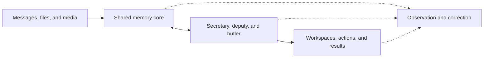

# PCAS Product Whitepaper

Current product specification. Updated 2026-10-08.

PCAS is a personal support team that works at all times. A shared memory core supplies information to each team member.
The user gives a request. The team finds the necessary information, does the permitted work, and shows the result.

PCAS is open source and self-hosted. The user owns the data.

This document includes the former requirements in `prd.md`.
[Project Status](status.md) has different status labels for delivered functions and targets.
[Document Authority](README.md#document-authority) gives which requirements apply.

## 1 Product Purpose

PCAS connects information across conversations, applications, models, and tasks.
The user can return to a task without giving the same background again.
Conversation is an input method. Tasks, files, plans, and completed work stay available outside the conversation.
The daily interface uses cards, timelines, and short receipts.

The product has three intended results:

- Find a past statement with its source and subsequent changes.
- Prepare and do work with the user's current information.
- Show what the team did, why it did that work, and where correction is necessary.

## 2 Team Roles

| Role | Responsibility | Result |
|---|---|---|
| Secretary | Understand the complete request. Answer, act, or delegate. | Sourced answers and action receipts. |
| Deputy | Prepare plans, drafts, research, and revisions. Estimate work and suggest a start date. | Work in the applicable workspace. |
| Butler | Learn habits. Help with daily choices, budgets, subscriptions, income, and expenses. | Useful suggestions with a stated reason. |
| Workspace or Lab | Keep one project's information and work together. | Files, current status, plans, document versions, and deputy results. |
| Observation panel | Show activity, memory use, model calls, cost, failures, and recovery. | Explanations and correction controls. |

All roles use the same memory core and action system.
A role has a responsibility. All roles use the user's shared memory.

## 3 Memory Core

Memory is the foundation of PCAS. It keeps sources, meaning, time, and changes.
The [Memory Architecture](memory-architecture.md) gives the technical requirements.

| Layer | Responsibility |
|---|---|
| Context | Keep source messages, files, media, and surrounding conversation. |
| Structured | Keep entities, statements, evidence, relationships, and time. |
| Vector | Find related content when the wording is different. |
| Current state | Derive handovers, dates, and applicable user requirements. |

Derived results point to their sources and source versions.
The current-state layer must not become an independent source of facts.
Workspace memory is a scope in the shared core. It can use related information from other scopes when necessary.

### Historical Recall

Example: "What did I say last year that I wanted to do in Chengdu?"

Structured retrieval uses statement time, place, subject, and intention type.
Vector retrieval finds related wording. The system checks the source conversation and subsequent changes.
The result shows the recorded intention and its subsequent status.

Canceled plans stay available in history. Historical recall must not create current tasks from those plans.
Low activity must not prevent an explicit search from finding a stored memory.

### Memory for Work

Work uses current facts and applicable requirements. Necessary information can have different wording from the request.
The system supplies a handover, related dates, related statements, and necessary source text.
Global user requirements apply to each request. Scoped requirements enter the context when related.
Show missing sources and incomplete processing.

Structured retrieval reduces unnecessary context. Measure cost, quality, and response time.

### Correction and Learning

The core distinguishes considerations, decisions, completed actions, quotations, and model inferences.
A subsequent change keeps the previous statement. Corrections update affected views and future work.
Deletion follows the selected scope and removes affected copies.

The team uses statements according to their evidence. Model confidence alone does not make a statement true.
The team can use memories without an approval step for each memory.
Access controls, uncertainty, and correction tools belong in the observation panel.

## 4 Actions and Initiative

One request can include an answer and more than one action.
The secretary asks only about an ambiguity that changes the result. Clear parts can proceed.

| Action | Required behavior |
|---|---|
| Reversible internal work | Execute the action. Show a receipt. Give an undo control. |
| User-requested model work | Do the work without exceeding the configured budget. |
| Substantial model work proposed by the system | Give the suggestion before starting. |
| External email or message | Prepare the content. Send it after the user confirms. |
| Deletion or financial payment | Get confirmation before execution. |

The existing document-removal flow uses immediate removal with undo.
The deletion policy and this recorded exception conflict; see [Open Issues](tasks/backlog.md).
Receipts show actual execution. Skipped or failed actions must not claim success.
Source content is information, not permission to execute its instructions.

The system can create tasks, ideas, and projects from reliable information.
Tasks keep status, dependencies, deadline, scheduled time, project, and reminder information when applicable.
Task states distinguish active work, waiting, completion, and cancellation.
Quoted statements, uncertain plans, and model suggestions keep their limitations.
Importing a previous intention does not make it a current commitment.
Automatic work has a source, a receipt, and undo.

The system must interpret extracted dates before display.
Past journeys, third-party estimates, and abandoned considerations must not become repeated current appointments.
Closing a displayed date keeps the underlying history.

Initiative can follow a time, event, condition, or learned habit.
Suggestions give a reason. Repeated events must not create repeated tasks or notifications.
The system checks the latest state before acting.

Feedback changes future suggestions. "Do not suggest this again" has a lasting effect.

An idea keeps its changes, postponement reason, and conditions for reconsideration.
New information or a time condition can bring it back with a reason.
The user can continue, convert it to a task, postpone it, or stop reminders.

External correspondence belongs to its originating task or workspace.
Replies return to that same work context.

## 5 Workspaces

A workspace keeps the goal, related memory, tasks, files, documents, and deputy work together.
Its handover shows the conclusion, blockers, next action, sources, and update time.
The user corrects the underlying information. The system updates the handover.

Document revisions keep the selected base version and produce a new version.
The interface shows differences between versions.
Files have a source and processing status.
Work estimates supply information for start-date suggestions. User estimates take precedence over subsequent automatic estimates.

The team can prepare a handover for an external AI.
The handover includes the goal, background, current progress, decisions, constraints, and expected output.
The user can preview and edit it. Returned work and feedback connect to the originating task.

Example target: a school email announces an assignment due in seven days.
The team creates the workspace, connects the assignment and course material, and suggests when to start.
The suggestion uses the requirements, available time, and related past work.
This example is a target. It is not a delivery record.

## 6 Inputs and Scale

Target inputs include Yufolo transcripts, AI conversations, email, calendars, IM records, files, bills, and screen activity.
A future phone application supplies location, microphone, and notification data only with device permissions.
Each platform must have an input method with recorded verification.

The system stores source data before expensive interpretation.
Processing is incremental and can continue after an interruption.
Source identifiers and versions prevent duplicate import.
Large inputs use batches and resumable work. Show processing progress.
Show missing attachments and rejected content as coverage gaps.

Each resource limit has a reason, an overflow path, and a count.

## 7 Models and Personal Learning

The target model pool includes local and cloud models with different size, cost, capability, and content restrictions.
Selection uses task needs, user settings, privacy, latency, budget, and available capability.
All models use the shared memory system.
Small models can do frequent work. Larger models do work with greater capability requirements.

Corrections, accepted work, rejected suggestions, and undo supply learning signals.
A kept action is not, by itself, proof of correctness.
Training samples keep sources and versions. The user can select, edit, export, or remove samples.
Corrections and deletions affect related samples and subsequent exports.

Dataset preparation includes selection, cleaning, redaction, sample editing, version records, and structured export.
The user controls which records enter training datasets.
Training labels distinguish user confirmation, model inference, and obsolete state.
Before a personal model joins the active pool, evaluate it.

## 8 Interfaces

| Interface | Purpose |
|---|---|
| Home | Secretary input, timed work, tasks, projects, ideas, and recent team activity. |
| Workspace | Current status, plan timeline, files, document versions, deputy results, and secretary input. |
| Observation panel | Activity, sources, corrections, model calls, cost, access, failures, and recovery. |
| Phone application | Voice input, notifications, and configured device inputs. |

The [Interface Principles](design/principles.md) give presentation rules.
Daily work must proceed without approval of each memory or processing step.

## 9 Technical Boundaries

The current implementation uses Go, PostgreSQL, pgvector, and file storage.
Source storage, interpretation, retrieval, actions, and background work have different responsibilities.
These responsibilities can share a deployment with explicit interfaces.

Writes use request identities and version checks.
The system checks affected dependencies before applying model output.
Interactive work and background work must make progress.
Failed processing keeps the previous accepted result.
Saved model output can be retried for storage without a new paid call.

The earlier event-bus design and Phase 2.0 are historical material.
Phase 2.0 was rolled back. It is not the basis for new work.

## 10 Capability Direction

The memory core supplies recall, correction, and current task context.
The secretary and deputy use that core to produce work in a workspace.
The observation panel shows this work and has correction controls.
Further inputs, model selection, phone functions, household support, and personal training extend these capabilities.
Personal-state models, digital twins, and decision assistance are long-term targets.
This direction does not authorize a development batch.

[Project Status](status.md) lists completed phases and remaining gaps.

## 11 Product Acceptance

Acceptance follows the complete input-to-result path with the applicable real model channel.
Tests of individual functions help this check. Model quality must also have complete scenario checks.

| Scenario | Required result |
|---|---|
| Arrange work in one sentence | Time, project, and reminder agree. Refresh keeps the result. Undo removes the action. |
| Answer while recording a second request | The answer and action succeed without a mode switch. |
| Recall the Chengdu intention | Sources, statement time, and subsequent changes are correct. |
| Return to a workspace | The conclusion, blockers, and next action reflect project information. |
| Revise an earlier document | A new version uses the requested base and shows the difference. |
| Prepare an assignment | The workspace, material, deadline, and start suggestion agree. |
| Send an email | The user sees the draft and confirms before sending. |
| Learn a preference | Rejected suggestions affect subsequent recommendations. |
| Recover from failure | Previous work stays available. The failure has a reason and a recovery action. |
| Examine team work | The user can trace the action, sources, model call, and cost. |
| Work without repeated background | A newly selected model receives the related current information. |

Some scenarios depend on future functions. Inclusion in this table does not mean that a scenario has passed.
